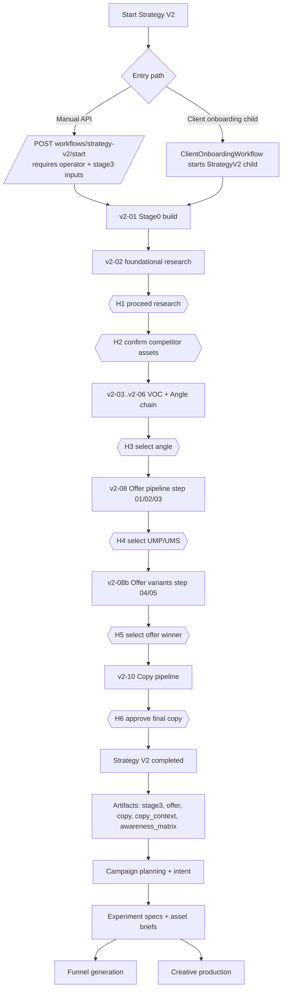
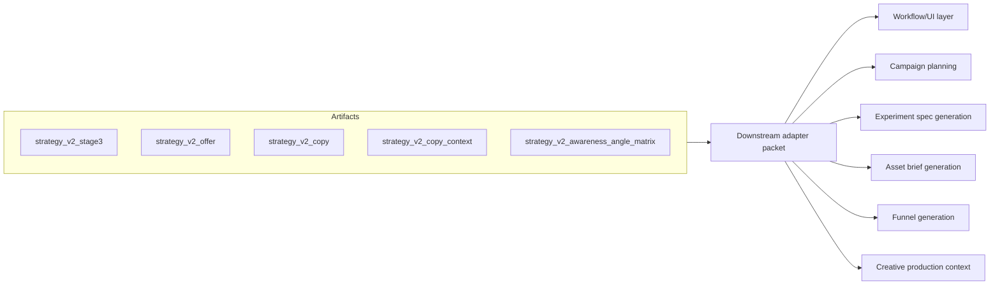
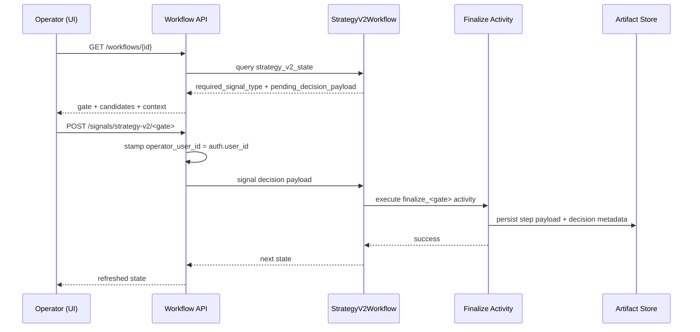

# Strategy V2 Fixes and Downstream Integration Review + Plan

**Date:** 2026-02-23  
**Repository:** `marketi`  
**Scope reviewed:** `V2 Fixes`, `mos/backend/app/strategy_v2`, Strategy V2 Temporal workflow, workflow APIs, and downstream campaign/experiment/funnel/creative interfaces.

---

## 1) Executive Summary

Strategy V2 is substantially implemented in backend runtime and artifacts, but downstream integration is only partial.

What is in good shape:
- Prompt-chain parity for Stage 2B, Stage 3, and Stage 4 is implemented.
- Six HITL pause points are implemented in the workflow runtime.
- Artifacts for Stage 3/Offer/Copy/Copy Context/Awareness Matrix are persisted and available.
- Campaign intent/planning/funnel generation are gated on Strategy V2 outputs when `strategy_v2_enabled` is true.

What is still blocking full downstream integration:
- HITL decision integrity is incomplete at API boundary (identity can be caller-supplied in payload).
- Frontend has no Strategy V2-specific UI for gates, decisions, or Strategy V2 artifacts.
- Frontend types do not model Strategy V2 state fields returned by `/workflows/{id}`.
- Onboarding-triggered Strategy V2 child runs do not pass required Stage 3 operator inputs (`business_model`, `funnel_position`, `target_platforms`, `target_regions`, `existing_proof_assets`, `brand_voice_notes`), which will fail at Offer pipeline input validation.
- Downstream consumers use mostly coarse JSON summaries/truncated strings instead of contract-first Strategy V2 adapters.

---

## 2) Review Method

I reviewed:
- Fix plan docs and source-of-truth checklist in `V2 Fixes/Integration/docs/plans` and `artifact-downloads`.
- Runtime workflow orchestration in `mos/backend/app/temporal/workflows/strategy_v2.py`.
- Runtime activities in `mos/backend/app/temporal/activities/strategy_v2_activities.py`.
- Contracts and supporting modules in `mos/backend/app/strategy_v2/*`.
- Workflow API endpoints in `mos/backend/app/routers/workflows.py`.
- Downstream workflow/activity consumers in campaigns, clients, strategy, experiment, and funnel generation flows.
- Frontend API/types/pages for workflow details and approvals.

---

## 3) Fix Status Review

## 3.1 Fix 01 Runtime Prompt-Chain Parity

**Status:** Implemented

Evidence:
- Stage 2B executes Agent 0/0b/1/2/3 prompt chain and scorer overlays with persisted step payloads.
  - `mos/backend/app/temporal/activities/strategy_v2_activities.py`
- Stage 3 uses Offer orchestrator and step prompts, including Step 04/05 variants loop.
  - `mos/backend/app/temporal/activities/strategy_v2_activities.py`
- Stage 4 uses prompt templates for headline, promise, advertorial, sales page, plus semantic and congruency gates.
  - `mos/backend/app/temporal/activities/strategy_v2_activities.py`
- Strict prompt runtime exists (prompt path resolution, placeholder enforcement, provenance).
  - `mos/backend/app/strategy_v2/prompt_runtime.py`

## 3.2 Fix 02 HITL Enforcement and Decision Integrity

**Status:** Partial

Implemented:
- Six workflow gate waits/signals exist: H1-H6.
  - `mos/backend/app/temporal/workflows/strategy_v2.py`
- Activity-level operator checks block obvious system-like IDs.
  - `mos/backend/app/temporal/activities/strategy_v2_activities.py`

Missing:
- Signal endpoints trust payload `operator_user_id` instead of binding to authenticated user.
  - `mos/backend/app/routers/workflows.py`
- Decision contracts lack `decision_mode`, attestation, reviewed-candidate audit fields.
  - `mos/backend/app/strategy_v2/contracts.py`

## 3.3 Fix 03 Copy Depth, Structure, and Promise Delivery Gates

**Status:** Partial

Implemented:
- Template-driven generation and semantic/congruency gates are implemented.
- Promise contract extraction from prompt output is implemented.

Missing vs plan:
- Explicit depth module (`copy_quality.py`) with word floor/ceiling and section depth reason-code taxonomy is not present.
- Current deterministic semantic gates do not fully match planned word-budget diagnostics.

---

## 4) Current End-to-End Workflow

### Key Strategy V2 artifacts used downstream
- `strategy_v2_stage3`
- `strategy_v2_offer`
- `strategy_v2_copy`
- `strategy_v2_copy_context`
- `strategy_v2_awareness_angle_matrix`

---

## 5) Downstream UI and Workflow Gaps

## 5.1 Highest Priority Gaps

1. Onboarding Strategy V2 child run is missing required Stage 3 operator inputs.
- `ClientOnboardingWorkflow` starts Strategy V2 with only org/client/product/onboarding payload and `operator_user_id="system"`.
- Offer pipeline requires non-empty `business_model`, `funnel_position`, `target_platforms`, `target_regions`, `existing_proof_assets`, `brand_voice_notes`.
- Result: onboarding-launched Strategy V2 runs are expected to fail at Offer input validation.
- Evidence:
  - `mos/backend/app/temporal/workflows/client_onboarding.py`
  - `mos/backend/app/temporal/activities/strategy_v2_activities.py` (`_require_offer_operator_inputs`)

2. Frontend does not implement Strategy V2 gates.
- Workflow detail page only supports campaign planning and creative production approvals.
- No Strategy V2 decision forms for H1-H6.
- No Strategy V2 candidate review UI for angle/pair/variant/copy.
- Evidence:
  - `mos/frontend/src/pages/workflows/WorkflowDetailPage.tsx`

3. Frontend data model does not expose Strategy V2 detail payload.
- `WorkflowDetail` type does not include `strategy_v2_state`, `strategy_v2_stage3`, `strategy_v2_offer`, `strategy_v2_copy`, `strategy_v2_copy_context`, `strategy_v2_awareness_angle_matrix`, or `pending_activity_progress`.
- Evidence:
  - `mos/frontend/src/types/common.ts`

4. HITL operator identity is not server-bound.
- Decision endpoints validate body contracts and forward payload as-is.
- Caller-supplied `operator_user_id` is accepted.
- Evidence:
  - `mos/backend/app/routers/workflows.py`
  - `mos/backend/tests/test_strategy_v2_workflow_api.py`

## 5.2 Medium Priority Gaps

1. Fallback state reconstruction drops `pending_decision_payload`.
- If Temporal query is unavailable, fallback inference sets `pending_decision_payload` to `None`.
- UI cannot reconstruct decision forms/candidates reliably on resume.
- Evidence:
  - `mos/backend/app/routers/workflows.py` (`_strategy_v2_state_from_research_artifacts`)

2. Downstream consumers are mostly prompt-summary based, not contract-first.
- Strategy and experiment/asset brief prompts include Strategy V2 artifacts as coarse dict or truncated JSON strings.
- This limits deterministic downstream behavior and UI traceability.
- Evidence:
  - `mos/backend/app/temporal/activities/strategy_activities.py`
  - `mos/backend/app/temporal/activities/experiment_activities.py`

3. Funnel prompt generation does not explicitly consume Strategy V2 structured packet.
- Funnel copy prompt uses strategy sheet + experiments + asset briefs, not direct Stage 3/copy context packet.
- Evidence:
  - `mos/backend/app/temporal/activities/campaign_intent_activities.py`

4. Mixed schema under `strategy_v2_copy` artifact type.
- Copy pipeline writes direct `copy_payload`; final approval writes `{"approved_copy": ..., "decision": ...}` under same artifact type.
- Downstream consumers need normalization to avoid ambiguity.
- Evidence:
  - `mos/backend/app/temporal/activities/strategy_v2_activities.py`

5. Price-resolution fallback behavior exists in Offer input mapping path.
- If price parse fails, code scrapes competitor URLs to infer price and retries mapping.
- This is fallback behavior and should be explicitly policy-approved.
- Evidence:
  - `mos/backend/app/temporal/activities/strategy_v2_activities.py` (`_map_offer_pipeline_input_with_price_resolution`)

---

## 6) Integration Architecture Needed Downstream

Recommended contract to introduce:
- `StrategyV2DownstreamPacket` normalized server-side from latest Strategy V2 artifacts.
- Stable fields for downstream:
  - `selected_angle` (id/name, evidence summary)
  - `offer` (ump, ums, core_promise, value_stack, guarantee_type, pricing_rationale)
  - `copy` (headline, promise_contract, page summaries, semantic/congruency statuses)
  - `copy_context` (audience/product/brand/compliance/awareness markdowns)
  - `decision_metadata` (gate decisions, operator, timestamps)
  - `provenance` (artifact IDs + versions)

---

## 7) Phased Implementation Plan

## Phase 0: Unblock Production Path (Critical)

**Objective:** Ensure onboarding-launched Strategy V2 runs can succeed and gate decisions are trustworthy.

Work:
1. Add required Stage 3 operator inputs to onboarding flow.
2. Alternatively pause Strategy V2 at an explicit pre-v2-08 operator input gate and collect inputs there.
3. Bind all Strategy V2 decision `operator_user_id` to authenticated `auth.user_id` in API layer.
4. Reject caller-supplied `operator_user_id` in signal payloads.

Acceptance:
- Onboarding Strategy V2 run can pass v2-08 without missing-input errors.
- Decision logs always show authenticated user identity.

## Phase 1: Backend Contract and API Hardening

**Objective:** Ship stable API contracts for Strategy V2 UI and downstream workflows.

Work:
1. Extend decision contracts with `decision_mode`, attestation, and reviewed-candidate metadata.
2. Add a typed response schema for workflow detail including all Strategy V2 fields.
3. Improve fallback state reconstruction to restore `pending_decision_payload` from step payload artifacts.
4. Normalize `strategy_v2_copy` retrieval so consumers always get canonical copy payload shape.
5. Explicitly policy-decide the price-resolution fallback behavior and either remove or document/flag it.

Acceptance:
- `/workflows/{id}` reliably returns Strategy V2 gate state and payloads even after Temporal query failure.
- Decision payloads are auditable and mode-aware.

## Phase 2: Frontend Strategy V2 UI Integration

**Objective:** Add full operator UX for Strategy V2 from run start to final approval.

Work:
1. Extend frontend `WorkflowDetail` type with Strategy V2 fields.
2. Add Strategy V2 section in workflow detail with:
   - stage timeline (`v2-01` to `v2-11`)
   - current gate card from `required_signal_type`
   - decision form renderer by gate type
   - candidate tables/previews from `pending_decision_payload`
3. Add frontend API wrappers for:
   - `POST /workflows/strategy-v2/start`
   - all six Strategy V2 signal endpoints
4. Add Tasks page Strategy V2-aware attention model:
   - prioritize runs with `required_signal_type != null`
5. Add Strategy V2 artifacts panel:
   - stage3, offer, copy, copy context, awareness matrix snapshots

Acceptance:
- An operator can complete H1-H6 from UI only.
- UI can resume in-progress gate review without losing candidate context.

## Phase 3: Downstream Workflow Contract Integration

**Objective:** Replace coarse prompt summary injection with structured Strategy V2 packet usage.

Work:
1. Add `StrategyV2DownstreamPacket` adapter in backend.
2. Refactor `strategy_activities` prompt builder to use selected packet fields instead of raw dict dumps.
3. Refactor experiment and asset-brief activities to use structured fields (not only truncated JSON summaries).
4. Add direct Strategy V2 packet usage to funnel prompt builder where relevant.
5. Re-evaluate downstream required artifacts:
   - require `stage3`, `offer`, `copy`, and `copy_context` where needed instead of only `offer` + `copy`.

Acceptance:
- Downstream prompts consistently reference normalized Strategy V2 fields.
- End-to-end outputs are traceable to specific Strategy V2 artifacts.

## Phase 4: Copy Quality Completion and Operator Diagnostics

**Objective:** Close remaining Fix 03 parity items and improve remediation UX.

Work:
1. Implement explicit word-floor/ceiling and section-depth gates per plan.
2. Add machine-readable reason codes for copy gate failures.
3. Surface gate diagnostics in UI for operator correction loops.

Acceptance:
- Shallow copy fails deterministically with explicit reason codes.
- Operators can act on failure diagnostics without log-diving.

## Phase 5: Validation and Rollout

**Objective:** Safe production rollout across backend and UI.

Work:
1. Add API tests for identity binding and decision mode enforcement.
2. Add onboarding Strategy V2 integration tests that include Stage 3 operator inputs.
3. Add UI integration tests for each Strategy V2 gate flow.
4. Add end-to-end test: Strategy V2 complete -> campaign planning -> experiment specs -> asset briefs -> funnel generation -> creative production.
5. Roll out behind feature flags in staged environments.

Acceptance:
- No manual shell interventions required for standard Strategy V2 to creative path.
- Operators can complete and audit all gates in product UI.

---

## 8) Sequence Diagram: HITL Gate Loop (Target State)

---

## 9) Decision and Ownership Checklist

1. Decide onboarding strategy for required Stage 3 operator inputs.
2. Decide strict policy for price-resolution fallback behavior.
3. Approve decision contract expansion (`decision_mode`, attestation, reviewed IDs).
4. Approve frontend scope: extend existing workflow detail vs dedicated Strategy V2 page.
5. Approve downstream packet contract fields for planning/experiments/funnels.

---

## 10) Recommended Execution Order

1. Phase 0 (critical blockers)  
2. Phase 1 (API contracts)  
3. Phase 2 (frontend gate UI)  
4. Phase 3 (downstream packet adapters)  
5. Phase 4 (copy depth completion)  
6. Phase 5 (validation and staged rollout)

This order removes runtime blockers first, then enables operator control, then hardens downstream quality and observability.

---

## 11) Implementation Update (2026-02-24)

### Completed in code

Backend:
- Bound Strategy V2 signal operator identity to authenticated user in workflow API (caller-supplied `operator_user_id` no longer trusted).
- Added strict HITL fields (`decision_mode`, attestation, reviewed candidate IDs, audited notes) and validation across H1-H6.
- Added/validated explicit H1 + H2 workflow gates.
- Added Strategy V2 downstream packet usage in campaign-intent/funnel and experiment asset-brief activities.
- Fixed downstream handoff bug in `experiment_activities` where stale prompt-arg names caused runtime failures.
- Added replay-hardening in `StrategyV2Workflow._wait_for_signal`: gate wait now requires minimally valid strict payload shape, preventing stale pre-attestation signals from auto-advancing on reset/replay.

Frontend:
- Added Strategy V2 workflow detail typing for state + artifacts.
- Added Strategy V2 gate UI on workflow detail for H1-H6 signal payloads.
- Added pending-activity progress and Strategy V2 artifacts summaries on workflow detail.
- Updated tasks prioritization for Strategy V2 attention workflows.
- Updated onboarding wizard to collect required Strategy V2 operator inputs (`business_model`, `funnel_position`, `target_platforms`, `target_regions`, `existing_proof_assets`, `brand_voice_notes`, `compliance_notes`).

Tests:
- Updated API and onboarding tests for strict HITL contracts and required onboarding fields.
- Current targeted Strategy V2/backend test sweep passes:
  - `tests/test_strategy_v2_workflow_api.py`
  - `tests/test_client_onboarding_v2_ordering.py`
  - `tests/test_strategy_v2_copy_pipeline_guards.py`
  - `tests/test_strategy_v2_workflow_ordering.py`

### Live validation status on provided workflow

Workflow validated:
- `workflow_id`: `strategy-v2-41c2ac3c-91a2-4f00-ba55-c0d2a190b2a7-c4dc509f-6d7e-4a60-b499-de351e796fb0-c1eb6b1d-1d0e-4c9b-ada8-ec1f8284fd40-d695bc98-0714-4535-bb68-024c792e5952`

Resolved during live run:
- Offer pipeline numeric price blocker: onboarding payload price was missing and now set to real observed offer value (`$37`) for this payload id.
- Reset/replay stale HITL signal issue: fixed in workflow wait logic and validated by replaying to H2 wait.

Current blocker (external):
- Runtime now stalls in `strategy_v2.run_voc_angle_pipeline` with OpenAI Responses API `insufficient_quota`.
- This is not a contract/workflow bug; it is an external provider quota/billing failure and prevents completing a full end-to-end live pass (H3-H6 and downstream workflow chain) until quota is available.
