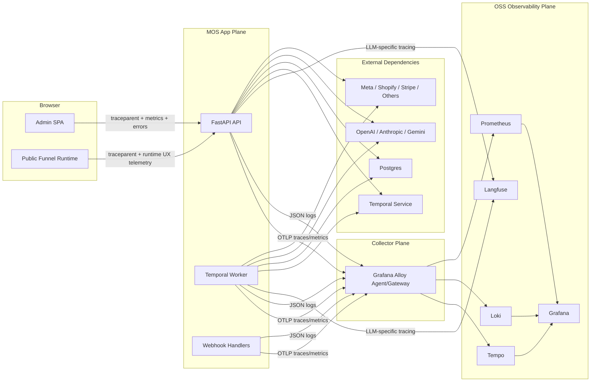

# MOS Telemetry Spec

## Decision

MOS should standardize on:

- OpenTelemetry for traces and metrics across backend, Temporal, and browser-adjacent surfaces.
- Structured JSON logging to stdout for Python services, collected and enriched by an OpenTelemetry Collector distribution.
- Grafana Alloy as the collector tier.
- Grafana Tempo for traces.
- Grafana Loki for logs.
- Prometheus first for metrics storage and alert evaluation, with Grafana Mimir as the scale-out option once retention or HA requirements outgrow a single Prometheus.
- Grafana as the correlation and dashboard layer.
- Langfuse retained for LLM-specific prompt/runtime inspection, but not as the system-of-record for platform telemetry.
- A separate application tracking plane for MOS business and product events, backed by Postgres and kept distinct from traces, logs, and infrastructure metrics.

This gives MOS an open-standard telemetry plane for operations, a first-class open-source backend for logs/metrics/traces correlation, and a separate, explicit source-of-record for application behavior and business progression.

## Why This Is The Right Fit For MOS

MOS is not a single web app. It is a distributed system with:

- a FastAPI API process
- a Temporal worker process
- a React admin SPA
- a React public funnel runtime
- webhook entrypoints
- background LLM and media-generation flows
- deploy/publish jobs
- external API dependencies including OpenAI, Anthropic, Gemini, Meta, Shopify, Stripe, Namecheap, Bunny, S3-compatible media storage, and Temporal itself

The telemetry stack therefore has to do four things well:

1. Correlate one unit of work across HTTP requests, Temporal workflow/activity execution, database work, and third-party API calls.
2. Support high-cardinality operational context like `workflow_run_id`, `agent_run_id`, `campaign_id`, and `funnel_id` without destroying metric or log query performance.
3. Preserve a clean boundary between product analytics and platform observability.
4. Remain self-hostable and open-source end to end.

The recommended stack matches those needs best.

## Current MOS State

### What already exists

- Langfuse is initialized at API and worker startup in [`mos/backend/app/main.py`](../mos/backend/app/main.py) and [`mos/backend/app/temporal/worker.py`](../mos/backend/app/temporal/worker.py).
- Langfuse spans/generations already wrap a meaningful part of LLM-heavy execution in:
  - [`mos/backend/app/llm/client.py`](../mos/backend/app/llm/client.py)
  - [`mos/backend/app/services/deep_research.py`](../mos/backend/app/services/deep_research.py)
  - [`mos/backend/app/agent/runtime.py`](../mos/backend/app/agent/runtime.py)
  - selected Temporal activities such as ad breakdown and swipe image generation
- Public funnel runtime events are already recorded as business events in [`mos/backend/app/routers/public_funnels.py`](../mos/backend/app/routers/public_funnels.py) and emitted from [`mos/frontend/src/pages/public/PublicFunnelPage.tsx`](../mos/frontend/src/pages/public/PublicFunnelPage.tsx).
- Meta pixel events already exist in the public runtime via [`mos/frontend/src/lib/metaPixel.ts`](../mos/frontend/src/lib/metaPixel.ts).
- The backend already depends on `structlog`, but it is not wired into the runtime yet in [`mos/backend/pyproject.toml`](../mos/backend/pyproject.toml).

### What is missing

- No request middleware that creates a root trace/span per inbound HTTP request.
- No canonical `trace_id` / `request_id` propagation across API, Temporal, browser fetches, background callbacks, and external HTTP calls.
- No system-wide structured logging schema.
- No central collector tier.
- No consistent metrics layer for API latency, Temporal throughput, DB pool health, LLM behavior, external dependency health, or deploy/publish jobs.
- No alerting model based on RED or USE signals.
- No application-wide event taxonomy for admin, workflow, publish/deploy, or Meta launch lifecycles. Today, only public funnel runtime and commerce events are persisted in a structured way.
- No clear boundary between:
  - business events such as `checkout_started` and `order_completed`
  - platform telemetry such as request latency, exception count, exporter drops, worker backlog, or DB pool exhaustion

### Important architectural constraint

MOS currently runs as separate API and worker processes, and production deployment is still a simple Docker Compose topology in [`mos/infra/docker-compose.deploy.yml`](../mos/infra/docker-compose.deploy.yml). The initial telemetry design therefore has to work well on a single host before it grows into a multi-node topology.

## Open-Source Research Summary

### Research-backed observations

- OpenTelemetry remains the best open standard for unified traces, metrics, and logs, with stable metrics support and broad semantic conventions for HTTP, DB, messaging, and GenAI operations.
- OpenTelemetry Python traces and metrics are stable, but the Python logs signal is still marked as development. That means MOS should not bet its primary production logging path on OTel Logs emitted directly from Python application code.
- OpenTelemetry browser instrumentation is still marked experimental and mostly unspecified. Browser telemetry should therefore be staged carefully and not block the server-side program.
- Temporal Python supports both SDK metrics and OpenTelemetry tracing via `TracingInterceptor`, and its SDK/service metrics are already formally documented.
- Loki is explicit that labels must stay low-cardinality, and that high-cardinality query metadata should live in structured metadata instead of index labels.
- Tempo can derive span metrics and service graphs from traces, which is especially useful for MOS because many failures happen inside workflow/activity chains rather than only on synchronous HTTP request paths.
- Grafana documents tight correlation across Tempo, Loki, Prometheus/Mimir, and Grafana itself, including logs-to-traces and metrics-to-traces navigation.
- Grafana Alloy is now the recommended collector distribution on the Grafana side and is explicitly positioned as an OpenTelemetry Collector distribution with Prometheus-native pipelines.

### Stack options considered

| Option | Strengths | Weaknesses | MOS fit |
| --- | --- | --- | --- |
| OpenTelemetry + Grafana Alloy + Tempo + Loki + Prometheus/Mimir | Best open-source correlation story across traces/logs/metrics, good cardinality controls, strong collector story, Tempo metrics-generator, easy self-host path | Requires composing multiple OSS components | Best fit |
| SigNoz | Strong all-in-one OSS platform, OTel-native, simpler operator experience | More opinionated storage/backend choice, less composable with Langfuse and Prometheus-first ops habits | Good alternative, not preferred |
| Jaeger + Prometheus + Loki | Mature tracing, open-source, OTel ingest capable | Jaeger is still fundamentally a tracing-first backend; cross-signal composition is less coherent and requires more assembly | Not preferred |

### Recommendation

Adopt the Grafana LGTM pattern for MOS:

- `Loki` for logs
- `Grafana` for dashboards and correlation
- `Tempo` for traces
- `Prometheus` now, `Mimir` later, for metrics
- `Alloy` as the collector/control plane

Retain Langfuse alongside it for prompt, model, and LLM-run inspection because MOS already invested in that path and it is useful for AI workflow debugging. Do not try to make Langfuse own system logs or Prometheus-style metrics.

## Architecture



## Deployment Model

### Phase 1: single-host production

- Run one Alloy instance on the same Docker host as MOS.
- API and worker export OTLP traces and metrics to Alloy.
- API and worker log JSON to stdout.
- Alloy scrapes/tails container logs and forwards them to Loki.
- Prometheus scrapes:
  - Alloy internal metrics
  - Temporal service metrics
  - Postgres exporter metrics
  - cAdvisor / node exporter if host metrics are added

This matches the current compose topology and minimizes moving parts.

### Phase 2: multi-node or Kubernetes

- Run Alloy in a combined agent + gateway pattern.
- Agent instances stay local to workloads for stdout/file/host telemetry.
- Gateway instances own transformation, tail sampling, and export.
- Use trace-aware load balancing when tail sampling or service-graph/span-metric generation requires trace affinity.

## Service Inventory And Resource Naming

Every emitted signal must include `service.name`, `service.namespace`, `deployment.environment`, and `service.version`.

| Component | `service.name` | Notes |
| --- | --- | --- |
| FastAPI API | `mos-backend` | Includes all routers and synchronous service calls |
| Temporal worker | `mos-worker` | Includes activities and child-workflow execution |
| Admin frontend | `mos-frontend-admin` | Internal authenticated SPA |
| Public runtime frontend | `mos-frontend-runtime` | Customer-facing funnel runtime |
| Shopify bridge app | `mos-shopify-bridge` | If kept in scope for telemetry rollout |
| Testimonial renderer | `mos-testimonial-renderer` | Only if it is deployed as a separate service |

`service.namespace` should be `mos`.

`service.version` should be the Git SHA or release version from CI/CD.

## Canonical Correlation Model

MOS already has strong business identifiers. The telemetry model should standardize them instead of inventing a parallel set.

### Canonical MOS context attributes

These should be attached to traces and logs as available, and only selectively used in metrics labels when cardinality is bounded.

| Attribute | Where used | Cardinality policy |
| --- | --- | --- |
| `mos.org_id` | traces, logs | never a metric label |
| `mos.user_id` | traces, logs | never a metric label |
| `mos.client_id` | traces, logs | never a metric label |
| `mos.campaign_id` | traces, logs | never a metric label |
| `mos.product_id` | traces, logs | never a metric label |
| `mos.funnel_id` | traces, logs | never a metric label |
| `mos.page_id` | traces, logs | never a metric label |
| `mos.publication_id` | traces, logs | never a metric label |
| `mos.workflow_run_id` | traces, logs | never a metric label |
| `mos.temporal_workflow_id` | traces, logs | never a metric label |
| `mos.temporal_run_id` | traces, logs | never a metric label |
| `mos.workflow_kind` | traces, logs, metrics | allowed metric label |
| `mos.activity_type` | traces, logs, metrics | allowed metric label |
| `mos.agent_run_id` | traces, logs | never a metric label |
| `mos.tool_name` | traces, logs, metrics | allowed metric label if bounded |
| `mos.provider` | traces, logs, metrics | allowed metric label |
| `mos.model` | traces, logs | only expose `mos.model_family` in metrics |
| `mos.model_family` | traces, logs, metrics | allowed metric label |

### Request and trace identifiers

- Use W3C Trace Context as the canonical propagation format.
- Every inbound HTTP request gets:
  - `trace_id`
  - `span_id`
  - `request_id`
- `request_id` should default to the root trace id for simplicity unless an upstream request id already exists and is valid.
- Every structured log line must include `trace_id`, `span_id`, and `request_id` when in request context.

### Baggage rules

Only low-risk, low-cardinality baggage is allowed across process boundaries.

Allowed examples:

- `deployment.environment`
- `service.namespace`
- `mos.workflow_kind`

Disallowed baggage:

- `org_id`
- `user_id`
- `campaign_id`
- raw URLs
- emails, phones, addresses, names
- prompt bodies or completion bodies

High-cardinality business context should be reattached locally from application state and logged/traced as attributes, not shoved through baggage.

## Application Tracking Spec

### Decision

Application tracking is a distinct telemetry plane from platform observability.

- Keep [`funnel_events`](../mos/backend/app/db/models.py) as the source-of-record for public runtime and commerce events already emitted by:
  - [`mos/frontend/src/pages/public/PublicFunnelPage.tsx`](../mos/frontend/src/pages/public/PublicFunnelPage.tsx)
  - [`mos/backend/app/routers/public_funnels.py`](../mos/backend/app/routers/public_funnels.py)
  - [`mos/backend/app/routers/shopify_webhooks.py`](../mos/backend/app/routers/shopify_webhooks.py)
  - [`mos/backend/app/routers/stripe_webhooks.py`](../mos/backend/app/routers/stripe_webhooks.py)
- Add a new generalized `app_events` table for admin-side product, campaign, funnel authoring, workflow, publish/deploy, and Meta execution events.
- Add an `analytics_app_events_v1` read model or database view that normalizes `funnel_events` and `app_events` into one query surface for dashboards, benchmarks, and exports.
- Do not use traces, logs, or Prometheus metrics as the authoritative record for product analytics or operator workflow progression.

### Canonical application event envelope

Every application event should carry:

- `event_id`
- `event_name`
- `event_version`
- `occurred_at`
- `source_surface`
- `actor_type`
- `trace_id` when request context exists
- `request_id` when request context exists
- `org_id`
- `client_id` when applicable
- `product_id` when applicable
- `campaign_id` when applicable
- `funnel_id` when applicable
- `page_id` when applicable
- `publication_id` when applicable
- `workflow_run_id` when applicable
- `visitor_id` / `session_id` for public runtime flows
- `props_json` for domain-specific bounded metadata

Additional bounded identifiers should be included when the domain requires them, for example:

- `offer_id`
- `variant_id`
- `asset_id`
- `draft_version_id`
- `template_id`
- `experiment_spec_id`
- `meta_publish_run_id`

Naming rules:

- Use stable lower-case `snake_case`.
- Name events after business state transitions or accepted user actions, for example `campaign_created` or `funnel_publish_requested`.
- Do not create generic catch-all events like `button_clicked` or `api_called`.
- Do not emit free-text labels or raw URLs as dimensions inside `props_json`.

### Event planes and ownership

- Public funnel runtime and commerce:
  - source of record remains `funnel_events`
  - optimized for stage conversion and order attribution
- Admin and operator activity:
  - source of record should be `app_events`
  - optimized for product, campaign, authoring, workflow, and launch operations
- Platform observability:
  - source of record remains OTel traces, logs, and metrics
  - optimized for reliability and debugging

The rule is simple: if the question is "what happened in the product or business flow?", answer it from `funnel_events` or `app_events`, not from traces.

### Domain event taxonomy

#### Workspace and catalog lifecycle

Emit events from:

- [`mos/backend/app/routers/clients.py`](../mos/backend/app/routers/clients.py)
- [`mos/backend/app/routers/products.py`](../mos/backend/app/routers/products.py)

Required events:

- `client_created`
- `client_updated`
- `client_archived`
- `client_onboarding_started`
- `client_onboarding_completed`
- `shopify_connection_installed`
- `shopify_connection_removed`
- `shopify_default_shop_set`
- `product_created`
- `product_updated`
- `product_asset_uploaded`
- `product_primary_asset_set`
- `offer_created`
- `offer_updated`
- `variant_created`
- `variant_updated`
- `shopify_product_created`
- `shopify_product_synced`
- `shopify_variants_synced`

Primary KPIs:

- time from `client_created` to `client_onboarding_completed`
- percent of clients with an active Shopify connection
- percent of products with a checkout-ready variant
- time from `product_created` to first publishable funnel

#### Campaign planning and delivery

Emit events from:

- [`mos/backend/app/routers/campaigns.py`](../mos/backend/app/routers/campaigns.py)

Required events:

- `campaign_created`
- `campaign_delivery_updated`
- `campaign_delivery_validated`
- `campaign_creative_context_provider_set`
- `campaign_creative_context_loaded`
- `campaign_plan_requested`
- `campaign_plan_completed`
- `campaign_funnel_generation_requested`
- `campaign_funnel_generation_completed`
- `creative_production_requested`
- `creative_production_completed`
- `experiment_specs_created`

Primary KPIs:

- time from `campaign_created` to `campaign_plan_completed`
- time from campaign creation to first generated funnel
- creative production success rate
- percent of campaigns that reach launch-ready delivery configuration

#### Funnel authoring and AI-assisted editing

Emit events from:

- [`mos/backend/app/routers/funnels.py`](../mos/backend/app/routers/funnels.py)

Required events:

- `funnel_created`
- `funnel_updated`
- `funnel_duplicated`
- `funnel_enabled`
- `funnel_disabled`
- `funnel_page_created`
- `funnel_page_updated`
- `funnel_draft_saved`
- `funnel_ai_attachment_uploaded`
- `funnel_ai_generation_requested`
- `funnel_ai_generation_completed`
- `funnel_ai_generation_failed`
- `funnel_testimonials_generated`
- `funnel_sales_pdp_examples_generated`

Primary KPIs:

- drafts created per funnel
- AI generation success rate
- median time from `funnel_created` to first approved page version
- percent of funnels that reach publish-ready state

#### Workflow and approval lifecycle

Emit events from:

- [`mos/backend/app/routers/workflows.py`](../mos/backend/app/routers/workflows.py)
- Temporal workflow/activity completion handlers where workflow state is persisted

Required events:

- `workflow_started`
- `workflow_completed`
- `workflow_failed`
- `workflow_cancelled`
- `workflow_signal_submitted`
- `strategy_v2_angle_selected`
- `strategy_v2_research_proceeded`
- `strategy_v2_competitor_assets_confirmed`
- `strategy_v2_ums_selected`
- `strategy_v2_offer_winner_selected`
- `strategy_v2_final_copy_approved`
- `strategy_v2_launch_requested`

Primary KPIs:

- success rate by `workflow_kind`
- median workflow duration by `workflow_kind`
- approval wait time by signal type
- launch request rate per completed strategy workflow

#### Public funnel runtime and commerce

Emit events from:

- [`mos/frontend/src/lib/funnelTracking.ts`](../mos/frontend/src/lib/funnelTracking.ts)
- [`mos/frontend/src/pages/public/PublicFunnelPage.tsx`](../mos/frontend/src/pages/public/PublicFunnelPage.tsx)
- [`mos/backend/app/routers/public_funnels.py`](../mos/backend/app/routers/public_funnels.py)
- [`mos/backend/app/routers/shopify_webhooks.py`](../mos/backend/app/routers/shopify_webhooks.py)
- [`mos/backend/app/routers/stripe_webhooks.py`](../mos/backend/app/routers/stripe_webhooks.py)

Current phase-1 source-of-record events already present in `funnel_events`:

- `Entered Funnel`
- `pre_sales_page_view`
- `sales_page_view`
- `checkout_page_view`
- `thank_you_page_view`
- `custom_page_view`
- `pre_sales_to_sales_click`
- `sales_to_checkout_click`
- `custom_page_click`
- `checkout_started`
- `order_completed`

Primary KPIs:

- paid-entry to order conversion rate
- pre-sales to sales click-through rate
- sales page to checkout start rate
- checkout start to order completion rate
- order conversion rate by `publication_id`, `campaign_id`, `page_id`, and `provider`
- revenue and order count by publication and campaign

Important constraint:

- Do not treat `funnel_exit` as an authoritative KPI event. Browser exit events are lossy and should only be used, if at all, as supporting context.

#### Publish and deploy lifecycle

Emit events from:

- [`mos/backend/app/routers/funnels.py`](../mos/backend/app/routers/funnels.py)
- [`mos/backend/app/services/deploy.py`](../mos/backend/app/services/deploy.py)

Required events:

- `funnel_publish_requested`
- `funnel_publish_completed`
- `funnel_publish_failed`
- `funnel_deploy_requested`
- `funnel_deploy_completed`
- `funnel_deploy_failed`
- `publication_activated`

Primary KPIs:

- publish success rate
- deploy success rate
- median time from publish request to live publication
- median time from `funnel_created` to first successful deploy

#### Meta launch and management

Emit events from:

- [`mos/backend/app/routers/meta_ads.py`](../mos/backend/app/routers/meta_ads.py)

Required events:

- `meta_connection_created`
- `meta_connection_validated`
- `meta_workspace_config_created`
- `meta_workspace_config_selected`
- `meta_workspace_config_validated`
- `meta_creative_spec_created`
- `meta_adset_spec_created`
- `meta_publish_selections_updated`
- `meta_publish_plan_validated`
- `meta_publish_run_created`
- `meta_publish_run_completed`
- `meta_publish_run_failed`
- `meta_asset_uploaded`
- `meta_creative_created`
- `meta_campaign_created`
- `meta_adset_created`
- `meta_ad_created`

Primary KPIs:

- time from creative-ready campaign to `meta_publish_run_completed`
- publish-plan validation blocker rate by blocker type
- Meta publish success rate
- asset drop-off from selected asset to published ad

### Derived application reporting surfaces

The first application-facing dashboards or benchmark reports should answer:

- how long it takes a new client to become launch-ready
- how long it takes a campaign to move from creation to plan, funnel, creative, and launch
- how long it takes a funnel to move from creation to first live publication
- where public runtime users drop between entry, page progression, checkout start, and order completion
- where Meta launch pipelines fail between asset upload, creative creation, ad set creation, and final publish

### Instrumentation rules

- Emit application events on authoritative state transitions after the write succeeds.
- Prefer backend emission for source-of-record events whenever the backend owns the mutation.
- Frontend should emit only the public runtime navigation and interaction events that do not already have a stronger backend source.
- Every source-of-record application event should include `trace_id` and `request_id` when available so operators can jump from a business event to the technical trace.
- Do not emit duplicate "request received" and "request succeeded" application events unless both are materially useful to the product team.

## Distributed Tracing Spec

### Root span boundaries

Create a root span for every:

- inbound API request
- public webhook request
- Temporal workflow start
- Temporal activity execution
- browser page-load transaction for the public runtime if browser tracing is enabled

Do not create root spans for:

- every log line
- every ORM call by hand
- every utility function

### Standard span coverage

#### Backend API

Root span:

- HTTP route span with semantic HTTP attributes

Child spans:

- auth / Clerk verification
- DB query groups when materially slow or high value
- external HTTP client calls
- media storage operations
- checkout/session creation
- publish/deploy job enqueue
- LLM or AI generation calls

#### Temporal client and worker

Use Temporal Python `TracingInterceptor` so workflow execution stays in one coherent trace across:

- client start/signal/query calls
- workflow execution
- child workflow execution
- activity execution

Also enable Temporal SDK metrics via `TelemetryConfig`.

#### LLM and GenAI operations

For MOS, LLM spans should exist in both systems:

- OpenTelemetry as the platform trace of record
- Langfuse as the prompt/model inspection system

Each LLM span should include:

- provider
- model
- model family
- operation
- request duration
- token counts when available
- reasoning / tool / web-search flags where applicable
- MOS workflow identifiers

OpenTelemetry spans should use GenAI semantic conventions where the SDK and implementation make that practical. Langfuse metadata should include the current OTel trace id so the two systems can be cross-linked.

#### External HTTP clients

Instrument:

- `httpx`
- `requests`
- provider SDK wrappers where direct HTTP instrumentation is insufficient

Every external call span should have a bounded `mos.provider` value chosen from an allowlist such as:

- `openai`
- `anthropic`
- `gemini`
- `meta`
- `shopify`
- `stripe`
- `temporal`
- `namecheap`
- `bunny`
- `s3`
- `creative_service`

Never use raw hostnames as a metric label.

#### Database spans

Instrument SQLAlchemy engine calls. Sanitize statements so parameters are never captured.

Required DB attributes:

- db system
- logical operation
- table if known
- outcome
- duration

### Async continuation and span links

MOS has multiple async boundaries where a direct parent-child span relationship is not always correct:

- OpenAI background research webhook completion
- deploy/publish background jobs
- Shopify order completion webhook relative to checkout start

For these, store the originating `trace_id` and `span_id` with the job metadata and create continuation spans with span links rather than fake parent-child relationships once the original request is long gone.

### Sampling

#### Phase 1

- Server-side traces: 100% sample rate.
- Temporal workflow/activity traces: 100% sample rate.
- LLM traces: 100% sample rate.
- Public browser traces:
  - 100% errors and exceptions
  - 100% checkout flows
  - 20% successful page-load traces if browser tracing is enabled

#### Phase 2 tail-sampling policy

If trace volume becomes large enough to matter, implement collector-side tail sampling with this keep policy:

- keep 100% of traces with error status
- keep 100% of traces above latency threshold:
  - API root span > 2 seconds
  - activity span > 10 seconds
  - workflow span > 60 seconds
  - external provider span > 5 seconds
- keep 100% of deploy/publish traces
- keep 10% of healthy routine traces

Do not turn on aggressive sampling until baseline dashboards exist and the team knows which traces are actually needed.

### Trace naming

Use stable, low-cardinality names.

Examples:

- `GET /funnels/{funnel_id}`
- `POST /public/events`
- `workflow.strategy_v2`
- `activity.generate_assets_for_brief`
- `llm.openai.responses.create`
- `provider.shopify.checkout.create`
- `deploy.plan.apply`

Never put UUIDs, slugs, or free text in span names.

## Structured Logging Spec

### Logging implementation

Use standard library logging with `structlog` as the rendering/context layer so MOS does not need a massive logger API rewrite.

Implementation shape:

- stdlib loggers remain valid
- root logging config emits JSON in production
- `structlog.contextvars` carries request and workflow context
- dev mode may use a human formatter, but prod must always be JSON

### Required log schema

Every log line must include:

- `ts`
- `level`
- `service.name`
- `service.namespace`
- `deployment.environment`
- `service.version`
- `logger`
- `message`
- `trace_id`
- `span_id`
- `request_id`

When available, also include:

- `mos.org_id`
- `mos.user_id`
- `mos.client_id`
- `mos.campaign_id`
- `mos.funnel_id`
- `mos.workflow_run_id`
- `mos.temporal_workflow_id`
- `mos.agent_run_id`
- `mos.provider`
- `mos.model_family`
- `http.method`
- `http.route`
- `http.status_code`
- `error.type`
- `error.message`

### Example log line

```json
{
  "ts": "2026-03-19T20:15:31.123Z",
  "level": "info",
  "service.name": "mos-backend",
  "service.namespace": "mos",
  "deployment.environment": "production",
  "service.version": "git:abc1234",
  "logger": "app.services.deep_research",
  "message": "deep_research_job_completed",
  "trace_id": "7b1ac0d9c5b84dc595b972fa2af3a2b3",
  "span_id": "1bca0c4e56cdb93e",
  "request_id": "7b1ac0d9c5b84dc595b972fa2af3a2b3",
  "mos.org_id": "org_123",
  "mos.client_id": "client_456",
  "mos.workflow_run_id": "4cc1d70d-0f16-4f1c-8eb8-8da5df2f1452",
  "mos.temporal_workflow_id": "strategy-v2-8b7f",
  "mos.provider": "openai",
  "mos.model_family": "gpt-5",
  "duration_ms": 48213
}
```

### Loki indexing rules

Only low-cardinality fields become Loki labels.

Recommended labels:

- `service_name`
- `service_namespace`
- `deployment_environment`
- `level`
- `kind` where bounded, for example `api`, `worker`, `frontend`, `webhook`

Everything high-cardinality stays in structured metadata, including:

- `trace_id`
- `request_id`
- all `mos.*` IDs
- `service.instance.id`
- pod/container instance identifiers

This is mandatory. MOS has too many UUID-centric identifiers to index them safely.

### Redaction and data handling

Never log or trace by default:

- authorization headers
- cookies
- Clerk JWTs
- API keys or webhook secrets
- raw Shopify order webhook bodies
- full Stripe or Shopify note attributes
- email addresses
- phone numbers
- postal addresses
- payment details
- prompt bodies
- completion bodies
- full SQL statements with parameters

Allowed alternatives:

- presence flags
- hashes
- byte counts
- record counts
- safe IDs
- model/provider names

Langfuse may continue to hold prompt/completion detail under its own governance, but the main telemetry plane must not duplicate that data.

## Metrics Spec

### Metric design rules

- Prefer standard instrumentation metrics where available.
- Custom MOS metrics must use:
  - a `mos_` prefix
  - a single unit
  - base units
  - `_total`, `_seconds`, `_bytes`, `_info` suffix rules
- High-cardinality business identifiers never become metric labels.
- Label values must come from bounded enums or route templates, not raw IDs.

### Core custom metrics

| Metric | Type | Labels | Emitted by | Notes |
| --- | --- | --- | --- | --- |
| `mos_api_requests_total` | Counter | `route`, `method`, `status_class` | API | Root HTTP request count |
| `mos_api_request_duration_seconds` | Histogram | `route`, `method`, `status_class` | API | Primary RED latency metric |
| `mos_api_inflight_requests` | UpDownCounter or Gauge | `route` | API | Current concurrency |
| `mos_api_exceptions_total` | Counter | `route`, `error_type` | API | Unhandled exception count |
| `mos_external_requests_total` | Counter | `provider`, `operation`, `outcome` | API, worker | Third-party dependency health |
| `mos_external_request_duration_seconds` | Histogram | `provider`, `operation`, `outcome` | API, worker | Third-party latency |
| `mos_llm_requests_total` | Counter | `provider`, `model_family`, `operation`, `outcome` | API, worker | LLM request volume |
| `mos_llm_request_duration_seconds` | Histogram | `provider`, `model_family`, `operation`, `outcome` | API, worker | LLM latency |
| `mos_llm_tokens_total` | Counter | `provider`, `model_family`, `operation`, `token_type` | API, worker | Prompt/completion token totals |
| `mos_workflow_starts_total` | Counter | `workflow_kind` | API, worker | Workflow starts |
| `mos_workflow_completions_total` | Counter | `workflow_kind`, `status` | worker | Workflow terminal count |
| `mos_workflow_duration_seconds` | Histogram | `workflow_kind`, `status` | worker | End-to-end workflow duration |
| `mos_activity_duration_seconds` | Histogram | `workflow_kind`, `activity_type`, `status` | worker | Activity duration |
| `mos_agent_tool_calls_total` | Counter | `tool_name`, `status` | API, worker | Agent runtime tooling |
| `mos_agent_tool_call_duration_seconds` | Histogram | `tool_name`, `status` | API, worker | Tool latency |
| `mos_public_runtime_js_errors_total` | Counter | `page_stage`, `error_type` | public runtime | Browser error health |
| `mos_public_page_load_seconds` | Histogram | `page_stage`, `bundle_mode` | public runtime | UX page-load latency |
| `mos_public_resource_load_failures_total` | Counter | `resource_type`, `page_stage` | public runtime | Broken assets and script failures |
| `mos_checkout_starts_total` | Counter | `provider`, `page_stage` | API | Operational checkout starts |
| `mos_checkout_failures_total` | Counter | `provider`, `failure_kind` | API | Checkout infrastructure failures |
| `mos_publish_jobs_total` | Counter | `status` | API, worker | Funnel publish jobs |
| `mos_publish_job_duration_seconds` | Histogram | `status` | API, worker | Publish duration |
| `mos_deploy_jobs_total` | Counter | `operation`, `status` | API | Deploy/apply attempts |
| `mos_deploy_job_duration_seconds` | Histogram | `operation`, `status` | API | Deploy/apply latency |

### Standard metrics to ingest, not reinvent

#### From OpenTelemetry instrumentation

- HTTP server/client metrics
- DB client metrics
- runtime/process metrics
- host/container metrics where deployed

#### From Temporal

Ingest both:

- Temporal Service metrics
- Temporal SDK metrics

These are already defined by Temporal and include request latency, poll-empty behavior, workflow execution latency, activity schedule-to-start latency, worker slot gauges, and more.

#### From infrastructure exporters

- Postgres exporter
- node exporter
- cAdvisor or equivalent container metrics

### Metrics cardinality policy

Allowed label examples:

- `route="/public/events"`
- `workflow_kind="strategy_v2"`
- `provider="openai"`
- `model_family="gpt-5"`
- `status_class="5xx"`
- `outcome="error"`

Forbidden label examples:

- `user_id`
- `org_id`
- `campaign_id`
- `workflow_run_id`
- `trace_id`
- `page_id`
- `publication_id`
- `model="gpt-5.2-2025-12-11"` if model churn becomes high
- raw URL

When in doubt, keep it out of metrics and put it in traces/log structured metadata.

### Exemplars

Enable exemplars on the key histograms:

- API request duration
- external request duration
- LLM request duration
- workflow duration
- activity duration

That allows Grafana to jump from a latency spike directly into a representative trace in Tempo.

## Browser Telemetry Strategy

### Public funnel runtime

The public runtime is revenue-facing, so it needs browser telemetry before the admin SPA does.

Collect:

- navigation and route timing
- resource timing for images, scripts, CSS, and fonts
- JS exceptions and unhandled promise rejections
- fetch timing to MOS API routes
- page stage context such as `pre_sales`, `sales`, `checkout`, `thank_you`
- existing funnel business events stay separate and continue flowing to `funnel_events`

### Admin SPA

Collect later:

- route changes
- API latency
- JS exceptions
- save/publish operation failures

### Browser implementation choice

Because browser OTel instrumentation is still experimental, the staged plan is:

1. Add request correlation and explicit UX/error metrics first.
2. Add browser tracing only after server-side correlation is stable.
3. If MOS wants richer RUM faster, evaluate Grafana Faro for the public runtime specifically.

## Dashboards

Create these dashboards first:

1. MOS Executive Overview
2. API Health
3. Temporal Platform
4. Workflow and Activity Operations
5. LLM and Provider Health
6. Public Funnel Runtime
7. Publish and Deploy Operations
8. Observability Pipeline Health

### Dashboard contents

#### MOS Executive Overview

- request rate
- error rate
- p95 API latency
- workflow starts/completions/failures by kind
- LLM request error rate
- deploy/publish failure count
- public runtime JS error rate

#### API Health

- RED metrics by route
- top exception types
- DB pool pressure
- slow external providers
- webhook error rate

#### Temporal Platform

- service request/error/latency metrics
- SDK request latency
- worker slots used/available
- task queue poll empty/no poller
- activity schedule-to-start latency

#### Workflow and Activity Operations

- workflow start/completion/failure by kind
- workflow duration histograms
- activity latency by type
- agent tool call latency/error rate

#### LLM and Provider Health

- requests by provider/model family
- latency by provider/model family
- tokens by provider/model family
- failures by provider and operation
- deep research async lifecycle

#### Public Funnel Runtime

- page-load latency by stage
- JS errors by stage
- resource load failures
- checkout API latency/failure rate
- current public event ingestion latency and error rate

#### Publish and Deploy Operations

- publish job rate/duration/failures
- deploy apply duration/failures
- current queued/running jobs
- external DNS/CDN/provider latency

#### Observability Pipeline Health

- Alloy exporter queue length
- dropped spans/logs/metrics
- Loki ingestion health
- Tempo ingestion/search health
- Prometheus scrape health

## Alerting

### Priority 1 alerts

- API 5xx rate above threshold for 5 minutes.
- API p95 latency above threshold on key routes for 15 minutes.
- Temporal worker has no poller or schedule-to-start latency is elevated.
- Workflow failure rate spikes for any `workflow_kind`.
- LLM provider error rate spikes for any primary provider.
- Public runtime JS error rate spikes on any stage.
- Checkout failure rate spikes.
- Deploy or publish jobs fail repeatedly.
- Collector drops telemetry or exporter queue backs up.

### Priority 2 alerts

- DB pool timeout or saturation.
- Slow external dependency latency.
- Elevated webhook signature failures.
- Missing traces/logs/metrics from a service for more than 10 minutes.

## SLOs

Start with these SLOs:

- API availability: 99.9%
- Key API route latency: 95% of requests under 1 second for non-LLM routes
- Workflow completion success: 99% by `workflow_kind`
- Activity queue health: 99% of activity schedule-to-start under 30 seconds
- Public runtime crash-free sessions: 99.5%
- Telemetry pipeline health: no more than 0.1% dropped telemetry over 1 hour

## Security, Privacy, And Governance

### Default data posture

- Fail startup on invalid telemetry config in production.
- Do not fail startup just because the backend is temporarily unreachable; retry via collector buffering.
- Treat telemetry transforms as a governance layer, not an optional convenience.

### Data minimization

- OTel traces/logs carry operational context only.
- Langfuse carries prompt/completion detail.
- Business analytics stays in the business data plane.

### Retention

Initial retention targets:

- traces: 7 to 14 days
- logs: 14 to 30 days
- metrics: 30 to 90 days
- Langfuse: separate policy based on AI workflow needs

## MOS-Specific Rollout Plan

### Phase 0: foundations

Create a shared telemetry package in the backend:

- add `mos/backend/app/telemetry/`
- modules:
  - `config.py`
  - `context.py`
  - `logging.py`
  - `tracing.py`
  - `metrics.py`
  - `propagation.py`

Edit:

- [`mos/backend/app/config.py`](../mos/backend/app/config.py)
- [`mos/backend/app/main.py`](../mos/backend/app/main.py)
- [`mos/backend/app/temporal/worker.py`](../mos/backend/app/temporal/worker.py)
- [`mos/backend/app/db/base.py`](../mos/backend/app/db/base.py)

Add env vars:

- `TELEMETRY_ENABLED`
- `TELEMETRY_REQUIRED`
- `OTEL_EXPORTER_OTLP_ENDPOINT`
- `OTEL_EXPORTER_OTLP_PROTOCOL`
- `OTEL_RESOURCE_ATTRIBUTES`
- `TELEMETRY_LOG_LEVEL`
- `TELEMETRY_LOG_JSON`
- `TELEMETRY_TRACE_SAMPLE_RATE`

### Phase 1: API request tracing and structured logs

Edit:

- [`mos/backend/app/main.py`](../mos/backend/app/main.py)
- new request middleware to:
  - create root spans
  - extract/inject W3C context
  - bind request context into `structlog.contextvars`
  - map uncaught exceptions to trace status and structured error logs

Add instrumentation to hot-path routers first:

- [`mos/backend/app/routers/public_funnels.py`](../mos/backend/app/routers/public_funnels.py)
- [`mos/backend/app/routers/shopify_webhooks.py`](../mos/backend/app/routers/shopify_webhooks.py)
- [`mos/backend/app/routers/openai_webhooks.py`](../mos/backend/app/routers/openai_webhooks.py)
- [`mos/backend/app/routers/deploy.py`](../mos/backend/app/routers/deploy.py)
- [`mos/backend/app/routers/workflows.py`](../mos/backend/app/routers/workflows.py)

### Phase 1B: application tracking plane

Create a shared application-tracking package in the backend:

- add `mos/backend/app/app_tracking/`
- modules:
  - `events.py`
  - `schemas.py`
  - `emit.py`
  - `repository.py`

Database work:

- add `app_events`
- keep `funnel_events` as-is for public runtime and commerce
- add `analytics_app_events_v1` as a normalized query surface over `app_events` and `funnel_events`

Edit:

- [`mos/backend/app/routers/clients.py`](../mos/backend/app/routers/clients.py)
- [`mos/backend/app/routers/products.py`](../mos/backend/app/routers/products.py)
- [`mos/backend/app/routers/campaigns.py`](../mos/backend/app/routers/campaigns.py)
- [`mos/backend/app/routers/funnels.py`](../mos/backend/app/routers/funnels.py)
- [`mos/backend/app/routers/workflows.py`](../mos/backend/app/routers/workflows.py)
- [`mos/backend/app/routers/meta_ads.py`](../mos/backend/app/routers/meta_ads.py)
- [`mos/backend/app/routers/public_funnels.py`](../mos/backend/app/routers/public_funnels.py)
- [`mos/backend/app/routers/shopify_webhooks.py`](../mos/backend/app/routers/shopify_webhooks.py)
- [`mos/backend/app/routers/stripe_webhooks.py`](../mos/backend/app/routers/stripe_webhooks.py)

Frontend work:

- keep [`mos/frontend/src/lib/funnelTracking.ts`](../mos/frontend/src/lib/funnelTracking.ts) as the public-runtime event helper
- add `mos/frontend/src/lib/adminTracking.ts` for bounded admin-side action events only if the backend does not already own the authoritative transition

Goals:

- define the application event taxonomy in code
- emit one authoritative event per business transition
- correlate every event to request/trace context when available
- keep business reporting out of traces and logs

### Phase 2: Temporal tracing and metrics

Edit:

- [`mos/backend/app/temporal/worker.py`](../mos/backend/app/temporal/worker.py)
- [`mos/backend/app/temporal/client.py`](../mos/backend/app/temporal/client.py)

Implement:

- Temporal `TracingInterceptor`
- Temporal `TelemetryConfig`
- global tags/resource attributes that include bounded identifiers like `workflow_kind`, `task_queue`, and `deployment.environment`

Use existing MOS workflow IDs as trace/log attributes:

- `workflow_run_id`
- `temporal_workflow_id`
- `temporal_run_id`

### Phase 3: LLM and provider instrumentation unification

Edit:

- [`mos/backend/app/llm/client.py`](../mos/backend/app/llm/client.py)
- [`mos/backend/app/services/deep_research.py`](../mos/backend/app/services/deep_research.py)
- [`mos/backend/app/observability/langfuse.py`](../mos/backend/app/observability/langfuse.py)

Goals:

- wrap Langfuse spans with OTel spans or share the same current trace context
- emit custom LLM metrics
- capture token counts and provider latency
- attach OTel trace IDs into Langfuse metadata

### Phase 4: database and outbound dependency instrumentation

Edit:

- [`mos/backend/app/db/base.py`](../mos/backend/app/db/base.py)
- outbound integration modules such as:
  - [`mos/backend/app/services/shopify_connection.py`](../mos/backend/app/services/shopify_connection.py)
  - [`mos/backend/app/services/shopify_checkout.py`](../mos/backend/app/services/shopify_checkout.py)
  - [`mos/backend/app/services/meta_ads.py`](../mos/backend/app/services/meta_ads.py)
  - [`mos/backend/app/services/namecheap_dns.py`](../mos/backend/app/services/namecheap_dns.py)
  - [`mos/backend/app/services/media_mirror.py`](../mos/backend/app/services/media_mirror.py)
  - [`mos/backend/app/services/campaign_delivery.py`](../mos/backend/app/services/campaign_delivery.py)

Goals:

- standard provider labels
- shared error taxonomy
- duration histograms and outcome counters

### Phase 5: public runtime telemetry

Add frontend telemetry helpers:

- `mos/frontend/src/telemetry/browser.ts`
- `mos/frontend/src/telemetry/errors.ts`
- `mos/frontend/src/telemetry/performance.ts`
- `mos/frontend/src/telemetry/propagation.ts`

Edit:

- [`mos/frontend/src/api/client.ts`](../mos/frontend/src/api/client.ts)
- [`mos/frontend/src/pages/public/PublicFunnelPage.tsx`](../mos/frontend/src/pages/public/PublicFunnelPage.tsx)
- [`mos/frontend/src/runtimeBootstrap.tsx`](../mos/frontend/src/runtimeBootstrap.tsx)
- [`mos/frontend/src/adminBootstrap.tsx`](../mos/frontend/src/adminBootstrap.tsx)

Goals:

- inject `traceparent` into API fetches
- capture page-load metrics and JS errors
- preserve existing funnel business events separately

### Phase 6: observability infrastructure

Add infrastructure config under `mos/infra/observability/`:

- Alloy config
- Prometheus config
- Loki config
- Tempo config
- Grafana provisioning

Extend:

- [`mos/infra/docker-compose.deploy.yml`](../mos/infra/docker-compose.deploy.yml)

Add services:

- `alloy`
- `prometheus`
- `loki`
- `tempo`
- `grafana`

Mimir is optional and should wait until Prometheus retention, HA, or query load actually demand it.

### Phase 7: dashboards, alerts, and tests

Add:

- Grafana dashboard JSON provisioning
- Prometheus alert rules
- backend tests for:
  - application event schema and event-name allowlists
  - `analytics_app_events_v1` normalization
  - trace propagation
  - logging schema
  - redaction
  - metric label allowlists

Potential test files:

- `mos/backend/tests/test_app_tracking_events.py`
- `mos/backend/tests/test_telemetry_logging.py`
- `mos/backend/tests/test_trace_propagation.py`
- `mos/backend/tests/test_metric_labels.py`

## Acceptance Criteria

The rollout is successful when:

- every inbound API request has a root trace and correlated JSON logs
- traces continue across API -> Temporal -> activity -> provider call boundaries
- client, campaign, funnel, workflow, publish, commerce, and Meta launch lifecycles all have explicit source-of-record application events
- public runtime and admin-side lifecycle events can be queried from one normalized application-event surface without reading traces
- one click from Grafana can navigate:
  - metric -> trace
  - trace -> logs
  - logs -> trace
- public runtime JS errors and page-load regressions are visible by funnel stage
- public runtime conversion and launch/readiness KPIs are visible without reconstructing them from infrastructure telemetry
- deploy/publish failures are diagnosable without SSHing into the box first
- LLM runs are visible in both Grafana and Langfuse without duplicating sensitive prompt bodies into the platform telemetry plane
- no high-cardinality business IDs are used as Prometheus labels or Loki index labels

## Sources

- OpenTelemetry concepts: traces, metrics, logs, context propagation
  - <https://opentelemetry.io/docs/concepts/signals/traces/>
  - <https://opentelemetry.io/docs/concepts/signals/metrics/>
  - <https://opentelemetry.io/docs/concepts/signals/logs/>
  - <https://opentelemetry.io/docs/concepts/context-propagation/>
- OpenTelemetry semantic conventions
  - <https://opentelemetry.io/docs/specs/semconv/http/http-spans/>
  - <https://opentelemetry.io/docs/specs/semconv/db/database-spans/>
  - <https://opentelemetry.io/docs/specs/semconv/messaging/messaging-spans/>
  - <https://opentelemetry.io/docs/specs/semconv/gen-ai/>
- OpenTelemetry Python and browser status
  - <https://opentelemetry.io/docs/languages/python/>
  - <https://opentelemetry.io/docs/languages/js/getting-started/browser/>
- OpenTelemetry Collector deployment and transforms
  - <https://opentelemetry.io/docs/collector/deploy/gateway/>
  - <https://opentelemetry.io/docs/collector/transforming-telemetry/>
- Temporal metrics and Python tracing support
  - <https://docs.temporal.io/references/sdk-metrics>
  - <https://docs.temporal.io/references/cluster-metrics>
  - <https://github.com/temporalio/sdk-python>
- Grafana open-source observability components
  - <https://grafana.com/docs/loki/latest/get-started/labels/>
  - <https://grafana.com/docs/loki/latest/get-started/labels/structured-metadata/>
  - <https://grafana.com/docs/tempo/latest/>
  - <https://grafana.com/docs/tempo/latest/metrics-generator/>
  - <https://grafana.com/docs/grafana/latest/datasources/tempo/traces-in-grafana/link-trace-id/>
  - <https://grafana.com/oss/alloy-opentelemetry-collector/>
  - <https://grafana.com/docs/opentelemetry/collector/>
  - <https://grafana.com/docs/alloy/latest/introduction/why-alloy/>
- Prometheus naming and histogram practices
  - <https://prometheus.io/docs/practices/naming/>
  - <https://prometheus.io/docs/practices/histograms/>
- Alternatives reviewed
  - <https://signoz.io/docs/architecture/>
  - <https://www.jaegertracing.io/docs/2.0/features>
