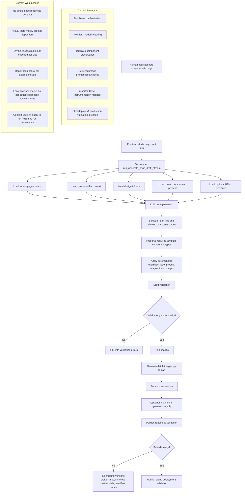
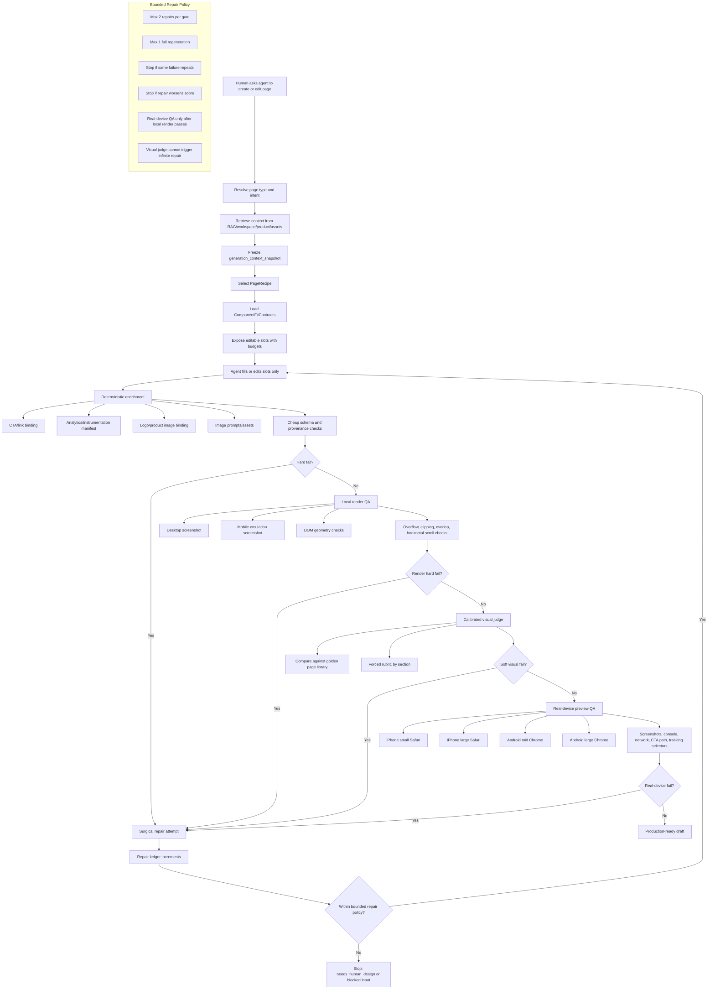

# Page Production Machine Report

Date: 2026-05-22

Decision: do not solve page quality by asking the agent to be better. Solve it by making page generation a constrained, layout-aware, validator-bounded machine.

## Current Machine



## Proposed Machine



## Gap Report

### 1. Missing Page Readiness Contract

Current state: validation is distributed across draft validation, template-specific config validation, imported HTML manifest validation, image planning, and publish validation.

Problem: no single artifact says, "this page is production-ready because these requirements passed."

Needed:

- `PageReadinessContract`
- required sections by page type
- required slots by section
- required analytics events and selectors
- required assets and image behavior
- required render/device checks
- required provenance snapshot
- final readiness report with pass/fail/blocker states

### 2. Context Should Be Retrieved, Not Pre-Bundled

Rejected abstraction: static `SourcePack`.

Better abstraction: retrieval-backed context, frozen per run.

Needed artifact:

```json
{
  "generationContextSnapshot": {
    "retrievedChunks": [],
    "productRecords": [],
    "offerRecords": [],
    "assetsReferenced": [],
    "claimsUsed": [],
    "missingFacts": []
  }
}
```

This preserves human/operator flexibility while preventing post-hoc ambiguity about what the agent relied on.

### 3. Recipes Need Layout-Aware Slot Budgets

Current problem: recipes that only say `hero.headline`, `body`, `ctaLabel` miss the real constraint: copy length can break the layout.

Needed:

```json
{
  "slot": "hero.headline",
  "purpose": "first-viewport promise",
  "maxCharsDesktop": 64,
  "maxCharsMobile": 42,
  "maxLinesMobile": 3,
  "containerRole": "hero_left_column",
  "mustFitAboveFold": true,
  "overflowPolicy": "rewrite_shorter"
}
```

Each component should declare:

- max chars by breakpoint
- max words when relevant
- max rendered lines
- CTA tap target minimum
- image aspect ratio and focal point rules
- allowed copy density
- repair strategy: rewrite, stack, hide secondary copy, resize container, or fail

### 4. Computers Need Objective Breakage Checks Before Visual Judgment

Current problem: "looks off" is too fuzzy for deterministic checks.

Do not ask computers to understand taste first. Make them catch objective failures:

- horizontal scroll
- clipped text
- text overflow
- element overlap
- blank sections
- placeholder copy/images
- broken images
- CTA hidden or pushed too low
- low contrast
- missing analytics selector
- dead CTA click
- section too tall on mobile
- product image missing from sales hero

Then use a visual judge for the remaining fuzzy judgment.

### 5. Visual Judge Needs Calibration

Current problem: a generic AI judge can say a broken page is fine or nitpick a usable page.

Needed:

- golden page library by page type
- accepted and rejected examples
- forced rubric, not open-ended taste questions
- section-level scoring
- screenshot panel across desktop, mobile emulation, and real devices

Output states:

- `hard_fail`: broken render, assets, analytics, links, or schema
- `soft_fail`: visually off, repairable
- `pass_with_notes`: launchable, improvement queue exists
- `pass`: launchable
- `needs_human_design`: ambiguous taste or repeated repair failure

### 6. Real-Device Preview QA Is A Separate Gate

Current browser automation and mobile emulation are useful but incomplete.

Needed preview gate:

- temporary preview URL
- real iOS Safari
- real Android Chrome
- screenshots
- console errors
- network errors
- broken image detection
- scroll path
- CTA view/click path
- analytics selector verification

Minimum device matrix:

- iPhone small viewport, Safari
- iPhone large viewport, Safari
- Android mid-size, Chrome
- Android large viewport, Chrome

Rule: no page can be marked production-ready unless real-device preview QA passes or is explicitly waived.

### 7. Repair Loops Need Kill Switches

Current risk: validators can burn time by triggering repeated full-page repairs.

Needed:

- repair attempt ledger
- per-gate retry cap
- repeated-failure detection
- score regression detection
- surgical repair operations
- stop states

Example:

```text
failure: hero headline overflows on iPhone Safari
operation: rewrite slot hero.headline under 42 chars
not allowed: regenerate whole page
```

Stop conditions:

- same failure repeats twice
- repair worsens render score
- missing source fact blocks completion
- issue maps to no known edit operation
- real-device failure cannot be reproduced locally after bounded attempts

### 8. Draft Valid Is Not Production Ready

Current machine can produce a valid Puck tree and saved draft without proving:

- mobile device quality
- page visual hierarchy
- section completeness
- analytics path correctness
- CTA path correctness
- launch artifact quality

Needed state model:

```text
draft_created
-> structurally_valid
-> render_valid
-> visually_launchable
-> real_device_valid
-> publish_ready
```

Do not collapse these states into one `valid` flag.

## Proposed Core Artifacts

| Artifact | Purpose |
|---|---|
| `PageRecipe` | Defines page type, section sequence, allowed variants, required slots, analytics hooks. |
| `ComponentFitContract` | Defines layout budgets and breakpoint behavior for every editable slot. |
| `generation_context_snapshot` | Freezes retrieved RAG/workspace/product/asset context used by the run. |
| `ReadinessContract` | Machine-checkable requirements for production readiness. |
| `RenderQaReport` | DOM and screenshot QA results across desktop and emulated mobile. |
| `VisualJudgeReport` | Calibrated visual assessment against golden examples. |
| `RealDevicePreviewReport` | BrowserStack-class device screenshots, console/network errors, click paths. |
| `RepairLedger` | Attempts, failures, edit operations, regressions, stop reasons. |

## Clean Target Rule

AI may create candidates. The system decides readiness.

The system should make bad pages difficult to create, cheap to detect, bounded to repair, and impossible to mark production-ready without proof.

