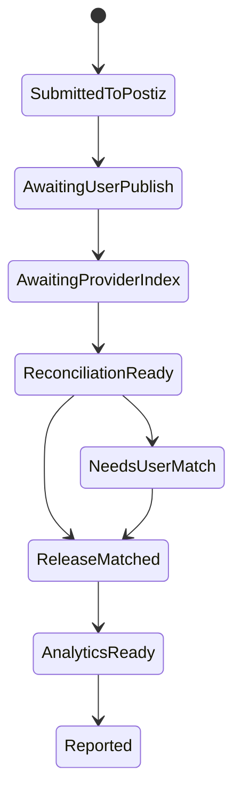

# PRD: TikTok Carousel Agent + Conversion Loop

Status: Draft for review  
Owner: Aldrin / mOS  
Date: 2026-05-22  
Source capture: `captures/larry_agent_workflow/source_manifest.json`

## Decision

Support Larry-style workflows as a first-class mOS agent pattern:

- Agent operates on behalf of a user.
- Agent produces TikTok carousel drafts.
- Agent posts or schedules through an approved publishing adapter.
- Agent pulls social analytics.
- Agent joins social performance to any configured conversion source.
- Agent uses that feedback to propose the next hooks, CTAs, creative directions, and app/funnel fixes.

Do not treat Larry as code to drop into mOS. Treat it as a workflow reference. The package is useful because it defines a full loop:


mOS should productize this as a generalized content experiment system:

- Output format v1: TikTok carousel.
- Publishing adapter v1: Postiz.
- Conversion source: pluggable.
- Agent runtime: Hermes profile with mOS tools.
- Authority: approval-gated external writes by default.

## Core Product Thesis

The real product is not "make TikTok slides."

The product is:

> A user delegates a growth loop to an agent. The agent creates content experiments, ships approved drafts, measures platform response and conversion response, then changes the next batch based on what broke.

This should eventually support:

- TikTok carousel + RevenueCat purchase/trial conversions
- TikTok carousel + PostHog signup/activation events
- TikTok carousel + Stripe checkout conversions
- TikTok carousel + Shopify/Medusa purchases
- TikTok carousel + lead form submissions
- Instagram/Reels/Shorts variants later, through the same publishing/conversion contracts

## What Larry Contains

Captured files:

- `SKILL.md`: full conversational workflow and operating rules.
- `references/slide-structure.md`: six-slide formula and hook patterns.
- `references/analytics-loop.md`: Postiz analytics plus conversion feedback loop.
- `references/revenuecat-integration.md`: RevenueCat-oriented conversion source notes.
- `references/competitor-research.md`: research workflow and competitor findings schema.
- `references/app-categories.md`: category prompt and hook templates.
- `scripts/generate-slides.js`: generates six slide images through configured image provider.
- `scripts/add-text-overlay.js`: burns high-contrast text into slide images.
- `scripts/post-to-tiktok.js`: uploads slides to Postiz and creates a TikTok slideshow draft.
- `scripts/check-analytics.js`: connects Postiz posts to TikTok release ids and pulls analytics.
- `scripts/daily-report.js`: joins social analytics and RevenueCat-style conversion data into a daily report.
- `scripts/onboarding.js`: creates and validates local config files.

Useful patterns to keep:

- conversational onboarding before automation
- competitor research before strategy
- strict carousel structure
- visual style lock before posting
- draft-first TikTok workflow
- delayed analytics reconciliation after user publish
- daily feedback report
- hook/CTA performance memory

Patterns to change for mOS:

- no local JSON config as source of truth
- no raw API keys in user-managed files
- no hard-coded model choice
- no hard-coded conversion provider
- no hard-coded performance thresholds
- no direct script-driven provider writes
- no unverified release-id matching without an ambiguity gate

## Existing mOS Fit

mOS already has pieces we should reuse:

- Postiz sidecar integration exists in backend and frontend.
- `client_postiz_credentials`, `client_postiz_channels`, `client_postiz_posting_profiles`, and `postiz_publications` already exist.
- `PostizClient` can validate credentials, list integrations, get social connect URLs, upload media from URL, create posts, list posts, and delete posts.
- `PostizSettings` already exposes workspace/client credentials, channel sync, posting profiles, and publication creation.
- Hermes runtime projection already exists through `hermes_sidecar.py` and `skills_runtime_registry.py`.
- mOS already persists products, campaigns, assets, artifacts, agent runs, and runtime sessions.

Main missing layer:

- content experiment entities
- TikTok carousel draft builder
- slide-level asset records
- social analytics sync endpoints
- release-id reconciliation
- conversion source abstraction
- attribution model
- Hermes tool profile for "growth loop agent"
- approval and authority model for external content writes

## Current Postiz Gap

Current mOS Postiz support is good publishing plumbing, not yet a Larry-style growth loop.

Missing from current Postiz client/router:

- per-post analytics endpoint
- platform analytics endpoint
- TikTok missing-release lookup
- TikTok release-id attachment
- direct media upload from local/generated asset bytes
- source-backed social analytics access for agent reports
- post-to-conversion reference fields that point at Postiz-owned post ids
- content experiment memory

Also note: Larry's `post-to-tiktok.js` reads `config.postiz.integrationId`, while its config template uses `postiz.integrationIds.tiktok`. That mismatch is one reason not to import the package as-is.

## Product Requirements

### R1. Agent Delegation Boundary

The user should be able to say:

> Make TikTok carousels for this app and optimize for conversions.

mOS turns that into a governed workflow:

1. identify workspace/client/app/product
2. connect or select publishing channel
3. connect or select conversion source
4. create content strategy
5. generate drafts
6. request approval
7. publish/schedule through adapter
8. sync analytics
9. attribute conversions
10. generate next actions

Hermes can reason and propose. mOS owns state, credentials, approvals, writes, schedules, and truth.

### R2. Conversion Source Abstraction

Do not build "RevenueCat integration" as the core object. Build `conversion_sources`.

Provider examples:

- `revenuecat`
- `posthog`
- `stripe`
- `shopify`
- `medusa`
- `custom_webhook`
- `manual_import`

Core interface:

- `validate_connection`
- `sync_events(start, end)`
- `normalize_event`
- `list_goal_events`
- `resolve_identity_or_campaign_tags`
- `summarize_window`

Normalized conversion event:

```json
{
  "provider": "revenuecat",
  "providerEventId": "source-id",
  "occurredAt": "timestamp",
  "eventName": "trial_started",
  "value": null,
  "currency": null,
  "userIdHash": "optional",
  "campaignRef": "optional",
  "contentExperimentId": "optional",
  "attribution": {
    "method": "tagged_link|post_window|manual|unknown",
    "confidence": "concrete|heuristic_derived|operator_entered"
  },
  "rawPayloadRef": "snapshot-id"
}
```

No conversion number should appear in an agent report unless it came from one of:

- connected provider payload
- mOS first-party event
- operator-entered import
- explicit manual override with provenance

### R3. Content Experiment Model

Create a durable experiment model instead of writing local folders.

Recommended tables/entities:

- `content_growth_programs`
  - app/product/client objective, platform set, conversion source, authority mode
- `content_experiments`
  - experiment name, hypothesis, hook family, CTA family, target audience, status
- `content_variants`
  - platform format, caption, title, slide count, CTA, prompt set, approval status
- `content_variant_slides`
  - slide index, image asset id, overlay text, prompt, visual role, render status
- `conversion_events`
  - normalized conversion source events
- `agent_action_proposals`
  - approval-gated Postiz composer handoff payloads for approved variants
- `hook_performance_rollups`
  - derived memory for agent planning, always source-backed

Postiz remains the system of record for composer, calendar, schedule, publish, post ids, release ids, and post status. The mOS growth layer should not create a parallel `content_publications` ledger. It should store approved variants, conversion events, and action proposals that hand approved payloads to Postiz.

### R4. TikTok Carousel Builder

The builder should be a mOS service, not a raw script.

Pipeline:

1. `storyboard`
   - agent proposes six slides, each with role, visual direction, overlay text, and CTA relationship
2. `image_generation`
   - mOS uses the configured image generation provider for the workspace
   - do not change model/provider without explicit operator config
3. `overlay_render`
   - server-side renderer burns text into each slide
   - dynamic font sizing and safe zones become renderer config, not hidden script constants
4. `preview`
   - UI shows six-slide contact sheet plus simulated TikTok safe-zone overlay
5. `approval`
   - user approves, rejects, edits text, regenerates slide, or locks style
6. `postiz_handoff`
   - approved variant becomes an approval-gated Postiz composer handoff proposal

Renderer requirements:

- portrait output
- per-slide overlay text stored before render
- rendered image asset stored after render
- no text outside safe zones
- no hidden text, logos, or watermarks unless user provided them
- deterministic renderer version stored on every rendered slide

### R5. Publishing Adapter

V1 should use Postiz because mOS already has the sidecar and public API integration.

Postiz responsibilities:

- channel OAuth/connect flow
- platform-specific posting constraints
- scheduling execution
- social publication state
- cross-posting where supported

mOS responsibilities:

- content draft ownership
- approval gate
- Postiz handoff proposal
- generated media storage
- local action history
- conversion references to Postiz-owned posts

TikTok-specific v1 behavior:

- default to TikTok draft/private/inbox flow where provider supports it
- user adds sound and publishes manually when required
- Postiz tracks draft/scheduled/published state
- mOS can store concrete Postiz post ids on conversion events when available

Do not build a direct TikTok poster in mOS v1 unless Postiz cannot support the required carousel flow.

### R6. Release ID Reconciliation

Larry's release-id logic is useful but too risky as-is.

Required mOS behavior:

- wait for provider indexing delay before attempting automated match
- fetch candidate TikTok posts/videos through adapter
- compare by publish time, thumbnail, channel, and expected sequence
- if one confident match exists, attach release id
- if multiple candidates exist, require user confirmation
- if already attached, treat release id as immutable unless the provider proves overwrite support
- store candidate list and reason for selected match

State machine:



### R7. Analytics Sync

Add Postiz analytics support to mOS.

Needed adapter methods:

- `get_platform_analytics(integration_id, start, end)`
- `get_post_analytics(post_id, start, end)`
- `list_posts(start, end)`
- `list_missing_release_candidates(post_id)`
- `attach_release_id(post_id, release_id)`

Persist:

- raw payload
- normalized metric labels
- provider timestamp
- observed window
- content publication id
- sync run id

If per-post analytics are missing, mOS may store platform-level deltas, but must label them as `heuristic_derived`. Do not present deltas as exact post metrics.

### R8. Attribution

Attribution should be honest and layered.

Best attribution:

- tagged link or UTM routes to mOS redirect
- app install/event provider carries campaign/content tags
- provider event includes source/campaign metadata

Acceptable attribution:

- operator-entered mapping
- time-window correlation marked `heuristic_derived`

Not acceptable:

- pretending time-window correlation is exact
- attributing all conversion spikes to the most recent post without source evidence
- using default benchmark numbers as truth

Attribution methods:

- `tagged_link`: concrete when click/install/event carries content id
- `provider_campaign`: concrete when conversion source returns campaign content id
- `post_window`: heuristic when only timing correlation exists
- `manual`: operator_entered
- `unknown`: no attribution

### R9. Agent Runtime Profile

Add Hermes runtime profile:

- `tiktok-carousel-growth-manager`

Projected context:

- app/product profile
- audience and pain points
- approved brand/style rules
- competitor research artifacts
- hook and CTA memory
- active content program
- prior variants and performance snapshots
- conversion source summaries
- authority contract
- available tools

Tools:

- `get_growth_program`
- `list_competitor_research`
- `create_content_experiment`
- `create_carousel_storyboard`
- `request_slide_generation`
- `request_overlay_render`
- `create_content_variant`
- `submit_for_approval`
- `create_postiz_handoff_proposal`
- `read_postiz_analytics`
- `sync_conversion_events`
- `create_daily_growth_report`
- `propose_next_experiments`

Hermes cannot:

- access Postiz or conversion provider secrets
- call publishing providers directly
- publish without approved variant id
- invent metrics
- change model/provider config
- alter authority mode

### R10. Review UI

Add a dedicated growth program surface.

Views:

- Setup
  - app profile
  - publishing channels
  - conversion source
  - authority mode
- Strategy
  - competitor research
  - hook families
  - CTA families
  - content hypotheses
- Builder
  - six-slide storyboard
  - generated images
  - overlay text editor
  - safe-zone preview
  - approval actions
- Calendar
  - draft, submitted, awaiting user publish, published, failed
- Analytics
  - post metrics
  - conversion metrics
  - attribution confidence
  - hook/CTA rollups
- Agent Report
  - what worked
  - what broke
  - next experiments
  - blocked data

Execution should not live only in chat. Chat is for reasoning and drafting. Durable UI state owns approvals and external actions.

## Authority Modes

V1 defaults:

- read social/channel data: allowed after connection
- create strategy and drafts: allowed
- generate images: allowed when provider configured
- submit TikTok draft via Postiz: approval required
- public posting: user/manual or explicit approved workflow
- conversion sync: allowed after connection
- daily report: allowed
- autonomous schedule changes: not in v1
- autonomous public publishing: not in v1

This gives the user an agent that operates on their behalf without letting it silently speak for them in public.

## Generalized Workflow

### 1. Program Setup

Inputs:

- workspace/client
- app/product/offer
- platform channel
- conversion source
- target conversion event
- allowed posting profile
- approval mode
- visual style constraints

Output:

- `content_growth_program`
- `conversion_source`
- `posting_profile`
- first research task

### 2. Research

Agent gathers:

- competitor accounts
- observed formats
- hooks
- CTAs
- visual patterns
- gaps

mOS stores research as source-backed artifacts. If research requires browser/platform access, capture source manifests. If a metric is not directly visible or captured, do not include it.

### 3. Strategy

Agent creates:

- hook bank
- CTA bank
- first experiment batch
- visual style profile
- posting plan

The strategy should be editable and versioned.

### 4. Build

Agent creates a six-slide storyboard and generation request.

mOS executes:

- image generation through configured provider
- overlay rendering
- asset persistence
- preview generation

User can edit:

- overlay text
- caption
- CTA
- slide prompt
- slide image
- target channel
- schedule

### 5. Approval

User approves the content variant.

mOS creates an action proposal:

- target channel
- provider adapter
- content
- media asset ids
- provider settings
- schedule/draft mode
- expected external side effect

Only approved proposals execute.

### 6. Publish / Draft Submit

mOS sends approved media and caption to Postiz.

Postiz returns post ids and status.

mOS records:

- variant draft payload
- approval decision
- Postiz handoff proposal
- conversion references to concrete Postiz ids when available

For TikTok draft/manual publish:

- user continues composer, sound, schedule, and publish work in Postiz/TikTok
- Postiz owns post lifecycle state
- mOS later reads source-backed Postiz analytics when needed

### 7. Sync

mOS reads Postiz analytics and concrete ids for reporting. It does not clone Postiz post lifecycle state into a second growth-program posting ledger.
- per-post analytics
- platform analytics
- conversion events
- attribution links

Each sync creates a run record and raw payload refs.

### 8. Diagnose

Agent report compares:

- reach/engagement
- conversion events
- attribution confidence
- hook family
- CTA family
- slide-one visual pattern
- posting time/channel if available

Output:

- keep/kill/test decisions
- next hooks
- next CTAs
- app/funnel issue flags
- blocked data

## Diagnostic Model

Use a configurable decision matrix, not Larry's hard-coded thresholds.

Axes:

- reach quality
- engagement quality
- conversion quality
- attribution confidence

Decision examples:

- reach strong, conversion strong: make controlled variations
- reach strong, conversion weak: test CTA and conversion path
- reach weak, conversion strong: test hook and slide-one visual
- both weak: change premise or audience angle
- downloads/signups strong but paid conversion weak: flag app/onboarding/paywall path

Thresholds should come from:

- workspace baseline
- platform baseline for the account
- operator-entered targets
- enough historical posts to compute distribution

Before baselines exist, the agent should say "insufficient baseline" and use ranked comparisons, not fake global standards.

## Data Model Draft

Core new tables:

- `content_growth_programs`
- `content_research_artifacts`
- `content_experiments`
- `content_variants`
- `content_variant_slides`
- `conversion_sources`
- `conversion_sync_runs`
- `conversion_events`
- `hook_cta_rollups`
- `agent_action_proposals` if not already created by the connected social PRD

Existing tables to bridge:

- `clients`
- `products`
- `campaigns`
- `assets`
- `artifacts`
- `agent_runs`
- `runtime_sessions`
- `client_postiz_credentials`
- `client_postiz_channels`
- `client_postiz_posting_profiles`
- `postiz_publications`

Design choice:

- Keep Postiz-specific posting state in Postiz and the existing Postiz adapter surfaces.
- Add content-specific strategy, variant, approval, and conversion tables only.
- Do not add a second mOS publication ledger for social posts.

## API Shape

Representative routes:

- `GET /clients/{client_id}/growth-programs`
- `POST /clients/{client_id}/growth-programs`
- `GET /growth-programs/{id}`
- `POST /growth-programs/{id}/research`
- `POST /growth-programs/{id}/experiments`
- `POST /content-variants/{id}/storyboard`
- `POST /content-variants/{id}/generate-slides`
- `POST /content-variants/{id}/render-overlays`
- `POST /content-variants/{id}/approve`
- `POST /content-variants/{id}/postiz-handoff-proposals`
- `POST /conversion-sources`
- `POST /conversion-sources/{id}/sync`
- `POST /growth-programs/{id}/daily-report`

Adapter extensions:

- `PostizClient.get_platform_analytics`
- `PostizClient.get_post_analytics`
- `PostizClient.list_missing_release_candidates`
- `PostizClient.attach_release_id`
- `PostizClient.upload_media_bytes` or reliable signed-URL upload flow

## MVP

Recommended v1:

1. Use existing Postiz connection/channel/profile system.
2. Add content growth program records.
3. Add TikTok carousel draft builder with manual image upload or generated assets from existing mOS asset pipeline.
4. Add overlay renderer service.
5. Add approval-gated Postiz handoff proposals for TikTok carousel drafts.
6. Add Postiz analytics reads without creating a second publication ledger.
7. Add one conversion source adapter first, but behind generic `conversion_sources`.
8. Add daily report that can run with only Postiz analytics and improves when conversion events are connected.

First conversion adapter recommendation:

- If this is mostly mobile app growth, start with RevenueCat.
- If this is any conversion across mOS clients, start with PostHog or custom webhook because it generalizes faster.

My recommendation: build the generic interface first, implement one adapter, and make the UI speak in terms of "conversion event" rather than "RevenueCat."

## Risks

- Postiz public API may not expose enough TikTok-specific analytics/release-id controls for a fully automated loop.
- TikTok draft/manual sound step prevents pure automation.
- Release-id matching can corrupt analytics if matched wrong.
- Conversion attribution can become fake if timing correlation is presented as certainty.
- Hard-coded thresholds will mislead small accounts and new niches.
- Image generation cost and latency need queue/state handling.
- The agent can create public brand risk if approvals are hidden inside chat.

Mitigations:

- adapter capability detection
- explicit `awaiting_user_publish` state
- ambiguous match queue
- attribution confidence labels
- workspace baselines
- background jobs for generation and sync
- first-class UI approval queue

## Open Decisions

1. First conversion adapter?

Recommendation: generic `conversion_sources` plus one concrete adapter. Choose RevenueCat if the first customer is a mobile app. Choose PostHog/custom webhook if the first customer is broader.

2. Use Postiz as required dependency?

Recommendation: yes for v1 publishing. mOS already has it. Do not duplicate channel OAuth/scheduling.

3. Direct TikTok public publish?

Recommendation: no. Submit drafts or scheduled Postiz posts only after approval. Keep public publish manual/explicit until we prove provider semantics.

4. Should carousel builder use existing mOS asset generation or Larry scripts?

Recommendation: existing mOS asset pipeline where possible. Port only the overlay-rendering logic as a service.

5. Should daily reports be Temporal workflows, Codex automations, or Hermes scheduled runs?

Recommendation: mOS scheduled job/Temporal for system state sync, Hermes run for narrative diagnosis. Do not put sync truth inside a chat-only process.

6. Should competitor research be automatic?

Recommendation: research task with source capture and user-visible findings. Do not store uncaptured view counts or competitor metrics.

## Acceptance Criteria

PRD acceptance:

- The generalized model "TikTok carousel + any conversion source" is accepted.
- Postiz remains the v1 publishing adapter or a different adapter is chosen.
- First conversion adapter is selected.
- Authority defaults are accepted.
- Release-id reconciliation policy is accepted.

Product v1 acceptance:

- Workspace can connect/select TikTok channel through Postiz.
- Workspace can connect/select one conversion source through generic interface.
- Agent can create a six-slide carousel storyboard.
- mOS can render six carousel images with stored overlay text and asset refs.
- User can approve a carousel variant before any external write.
- mOS can submit approved carousel to Postiz and store external ids/status.
- mOS can sync Postiz post status and analytics.
- mOS can sync conversion events from the configured source.
- Daily report distinguishes concrete metrics from heuristic attribution.
- Agent proposes next experiments without inventing missing data.

## Speed Map

Parallelizable: yes.

Lanes:

- Lane 1: content growth program and experiment data model.
- Lane 2: TikTok carousel builder and overlay renderer.
- Lane 3: Postiz adapter extensions for analytics and release reconciliation.
- Lane 4: conversion source abstraction and first adapter.
- Lane 5: Hermes runtime profile and tool contracts.
- Lane 6: review UI and approval queue.

Expected speed gain: high. The lanes share contracts but have mostly separate files.

Write ownership:

- data model/API: backend models, schemas, routers
- builder: rendering service, asset storage, generation orchestration
- Postiz: `postiz_client.py`, `routers/postiz.py`, repositories
- conversion: new conversion service/routes
- Hermes: runtime registry, projected skill/tool manifests
- frontend: growth program pages and builder/review screens

Fan-in contract:

`growth_program -> content_experiment -> content_variant -> postiz_handoff_proposal -> Postiz post -> conversion_event -> report`

## Review Questions

1. First concrete conversion adapter: RevenueCat, PostHog, Stripe, Medusa, Shopify, or custom webhook?
2. Is v1 specifically mobile-app growth, or should it start product-agnostic?
3. Do we want handoff-only v1, or should an approved proposal optionally call the existing Postiz API executor later?
4. Should carousel generation use existing mOS image assets first, or generate net-new images per post?
5. Do we want a standalone "Growth Programs" area, or should this live inside Campaigns?
6. What is the minimum approval boundary: approve storyboard, approve final rendered slides, or approve final provider payload?

Recommendation: approve final rendered slides and provider payload. Storyboards can stay draft-only.
