# PRD: Connected Social Agents For mOS

Status: Draft for review  
Owner: Aldrin / mOS  
Date: 2026-05-22  
Source capture: `captures/facebook_ads_agent_notion/source_manifest.json`, `captures/meta_api_docs/source_manifest.json`

## Decision

Build a first-party mOS connected-account layer for Meta, then expose two agent products on top of it:

- Meta Ads Manager Agent: connects a user's Meta assets, pulls ad account data, diagnoses performance, proposes actions, and applies approved changes.
- Social Media Manager Agent: connects a user's Facebook Page / Instagram business assets, drafts posts, schedules or publishes approved posts, and reports post performance.

Do not use Graphed as the control plane. The article's useful pattern is the operating loop:

1. connect account
2. pull platform truth
3. join platform truth to generated creative/content
4. let the agent reason over normalized snapshots
5. produce proposed actions
6. apply only actions that pass the workspace's authority rules
7. persist every read, proposal, approval, mutation, and result

mOS should own identity, OAuth, encrypted tokens, provider asset inventory, normalized snapshots, approvals, action logs, and UI. Hermes should operate as the reasoning/runtime adapter with mOS-provided tools. Hermes should not directly hold raw Meta tokens or become the system of record.

## Why This Matters

mOS already creates campaign strategy, creative assets, copy, funnels, Meta publish specs, and some Meta post-publish snapshots. The missing layer is customer-owned platform connectivity:

- A client should connect their own Meta account without pasting a raw access token.
- mOS should pull real ad and post data from that account.
- Agents should turn that data into decisions, drafts, and operator-approved actions.
- The same connection pattern should serve paid ads and organic social posting.

The product should feel like "connect my business assets, let the agent manage the workflow, show me what changed."

## Goals

- Replace manual token-paste workflows with Meta OAuth and asset selection.
- Pull real Meta ad account, campaign, ad set, ad, creative, Page, Instagram account, post, and insight data into mOS.
- Give Hermes a narrow, audited tool surface for read, plan, draft, and approved write actions.
- Make paid ads management and social posting share the same account, permission, approval, scheduling, and audit primitives.
- Keep writes approval-gated in v1.
- Fail cleanly when scopes, tokens, assets, or provider data are missing. Do not infer missing metrics or fake platform state.

## Non-Goals

- Do not copy Graphed's stack or make Graphed a dependency.
- Do not let Hermes call Meta directly with user tokens.
- Do not change the configured LLM/model.
- Do not autonomously increase spend, pause ads, publish posts, or reply to users in v1 without explicit approval.
- Do not build a generic all-network social scheduler in v1 if Meta-first solves the immediate need.
- Do not fabricate performance metrics, engagement data, dates, URLs, provider ids, or account ownership.

## Current Machine

Relevant existing mOS pieces:

- `meta_account_configs.py` resolves encrypted Meta tokens and workspace configs.
- `meta_ads.py` can list Meta pages, businesses, ad accounts, campaigns, ad sets, ads, and upload/create Meta objects.
- `meta_media_buying.py` can fetch ad-level insights and build deterministic management recommendations.
- `models.py` already has `MetaAdAccountConnection`, `MetaWorkspaceAdConfig`, `AssetPerformanceSnapshot`, `AgentRun`, `AgentThread`, and `RuntimeSession`.
- `hermes_sidecar.py` builds runtime projections and invokes Hermes.
- `skills_runtime_registry.py` has runtime profile infrastructure but no dedicated connected Meta/social manager profile yet.
- The frontend has Meta connection UI, but it currently depends on a pasted access token rather than user OAuth.
- There is a separate Postiz integration scope doc for outbound social posting through a sidecar. That is useful for future multi-network expansion, but the Meta-first path should not wait on Postiz.

Main gap: current Meta connectivity is admin/operator-oriented. It is not a self-serve customer OAuth flow with asset grants and agent authority boundaries.

## Designed Machine

Create a shared Connected Social Account layer:

```mermaid
flowchart LR
  User["User / Workspace Admin"] --> OAuth["Meta OAuth"]
  OAuth --> Conn["mOS Social Connection"]
  Conn --> Assets["Provider Asset Inventory"]
  Assets --> Sync["Provider Sync Jobs"]
  Sync --> Snapshots["Normalized Snapshots + Raw Payloads"]
  Snapshots --> Tools["mOS Agent Tools"]
  Tools --> Hermes["Hermes Runtime Profile"]
  Hermes --> Proposals["Action Proposals / Drafts"]
  Proposals --> Approval["Approval Gate"]
  Approval --> Executor["mOS Provider Executor"]
  Executor --> Meta["Meta APIs"]
  Executor --> Audit["Action Ledger"]
```

The same machine supports two product surfaces:

- Ads: ad account insights, creative performance, campaign management proposals, approved ad operations.
- Social: Page/Instagram content drafting, calendar, approved publishing, post insights, content performance feedback.

## Product Surface 1: Meta Ads Manager Agent

### User Story

As a workspace operator, I connect a client's Meta ad account, let mOS pull live campaign/ad data, and ask an agent to recommend what to pause, scale, duplicate, refresh, or draft next. I approve changes before mOS applies them.

### Required Flow

1. User starts Meta connection from workspace settings or campaign publish/manage.
2. mOS sends user through Meta OAuth.
3. mOS lists available businesses, ad accounts, Pages, and Instagram assets returned by Meta.
4. User grants selected assets to the workspace.
5. mOS stores encrypted token metadata and asset grants.
6. mOS runs a read-only sync of selected ad accounts.
7. mOS normalizes campaigns, ad sets, ads, creatives, and insights into durable snapshots.
8. Hermes runs through a `meta-ads-manager` profile with read-only tools first.
9. Hermes returns diagnosis, proposed actions, and optional new creative briefs.
10. User approves selected actions.
11. mOS executes approved provider mutations and records responses.

### V1 Capabilities

- Connect Meta user through OAuth.
- Select accessible Meta business assets and ad accounts.
- Pull campaign, ad set, ad, creative, and insight snapshots.
- Join live Meta ad ids back to mOS publish run items and generated assets when available.
- Produce read-only performance diagnosis.
- Produce action proposals:
  - pause ad
  - reactivate ad
  - adjust budget by operator-entered amount or approved workspace rule
  - duplicate/adapt winning creative into a draft
  - generate a new creative brief from observed winner/loser patterns
- Create paused draft ads only after approval.
- Apply provider mutations only through mOS executor, never directly from Hermes.

### Later Capabilities

- Scheduled monitor runs.
- Workspace-level guardrails for capped autonomous actions.
- Experiment recommendations across audiences, creatives, hooks, and funnels.
- First-party funnel metric joins with Meta spend/click data.
- Slack/email summaries if the workspace enables them.

## Product Surface 2: Social Media Manager Agent

### User Story

As a workspace operator, I connect a client's Facebook Page or Instagram business account, let mOS understand existing content and engagement, and ask an agent to draft, schedule, and publish approved posts on behalf of the brand.

### Required Flow

1. User connects Meta through the same OAuth flow.
2. mOS lists Pages and linked Instagram business accounts.
3. User grants selected social assets to the workspace.
4. mOS pulls recent posts and available post insights.
5. Hermes runs through a `social-media-manager` profile with brand strategy, campaign context, prior content, generated assets, and platform snapshots.
6. Hermes creates content drafts and calendar proposals.
7. User approves drafts and publish timing.
8. mOS publishes or schedules approved posts through the provider executor.
9. mOS syncs post status, release URLs, and insight snapshots.

### V1 Capabilities

- Connect Facebook Pages and Instagram business accounts attached to the user's Meta login.
- Pull recent Page/Instagram content and available post metrics.
- Draft platform-native post variants from mOS campaign/brand context.
- Attach existing mOS assets to posts when media is available and provider constraints pass.
- Approve, schedule, publish now, or cancel queued posts.
- Persist published post ids, URLs, status, raw provider response, and metric snapshots.
- Feed post performance back into future content briefs.

### Later Capabilities

- Comment triage and suggested replies.
- Cross-network publishing through Postiz or another adapter.
- Recurring content programs.
- Asset reuse recommendations from ad winners into organic posts.
- Organic winners promoted into paid ad drafts.

## Shared Platform Requirements

### R1. OAuth And Connection Ownership

mOS must support Meta OAuth for customer-owned accounts.

Requirements:

- Store provider, user id, granted scopes, token metadata, expiry metadata, and encrypted token material.
- Store selected workspace asset grants separately from the raw provider connection.
- Support reconnect, revoke, health check, and scope-upgrade flows.
- Preserve the manual token path only as an internal/admin bridge if needed, not the customer v1 path.

Candidate Meta scope groups to verify before implementation:

- Ads read: `ads_read`
- Ads write/manage: `ads_management`
- Page listing/engagement: `pages_show_list`, `pages_read_engagement`
- Page ad association: `pages_manage_ads` if required by the selected ad flow
- Page posting: `pages_manage_posts`
- Instagram business publishing: verify current Meta requirements during implementation; likely includes Instagram basic/content publishing permissions plus linked Page access

Do not hard-code scope assumptions without checking current Meta docs during implementation.

### R2. Provider Asset Inventory

mOS must represent connected assets independently from token records.

Recommended asset types:

- `business`
- `ad_account`
- `page`
- `instagram_business_account`
- `campaign`
- `adset`
- `ad`
- `creative`
- `post`

Each provider asset should store:

- provider
- provider asset id
- type
- display name
- parent asset id when known
- workspace/client grant
- capability flags
- last synced at
- status/error metadata
- raw payload pointer

### R3. Snapshot Storage

mOS must preserve both raw provider payloads and normalized snapshots.

Snapshot families:

- ads account inventory
- campaign/adset/ad inventory
- ad insights
- creative mapping
- social account inventory
- social posts
- post insights
- provider API event log

Every downstream-consumed metric must be sourced from provider payload, first-party mOS record, or operator-entered config. No synthetic metrics.

### R4. Agent Tool Boundary

Hermes receives mOS tools, not provider credentials.

Tool categories:

- read connection status
- list granted provider assets
- fetch normalized snapshots
- fetch raw payload by id when needed
- create action proposal
- create content draft
- request publish/ads execution for already-approved proposal

Hermes cannot:

- access raw OAuth tokens
- call Meta APIs directly
- mutate provider state without an approved proposal id
- silently change model, prompt authority, budget rules, or workspace posting rules

### R5. Approval And Action Ledger

All write-intent actions must enter an action ledger before execution.

Action proposal fields:

- workspace/client/campaign ids
- provider and target asset ids
- action type
- before snapshot reference
- proposed after state
- agent rationale
- risk label
- required permission/capability
- approval status
- approver
- approved at
- executed at
- provider response snapshot
- rollback hint where applicable

V1 default authority: approval required for every external write.

### R6. Runtime Profiles

Add dedicated Hermes runtime profiles:

- `meta-ads-manager`
- `social-media-manager`

Both profiles should project:

- workspace strategy artifacts
- relevant campaign/product/offers/assets
- connected provider asset grants
- latest normalized snapshots
- action authority contract
- tool documentation

They should not project secrets.

### R7. UI Surfaces

Recommended v1 UI:

- Connected Accounts settings
  - connect/reconnect Meta
  - asset picker
  - scope and health status
- Ads Manager Agent view
  - sync status
  - live campaign/ad table
  - performance diagnosis
  - action proposals
  - approval/execution history
- Social Manager Agent view
  - connected Pages/IG accounts
  - content drafts
  - calendar
  - approval queue
  - publish history
  - post metrics

Avoid hiding approvals inside chat. Chat can explain and draft, but execution needs first-class UI state.

## Data Model Draft

Prefer extending existing Meta models where they fit, but the new shape should be provider-general enough for social posting.

Recommended additions:

- `social_provider_connections`
  - one OAuth connection per user/provider/workspace boundary
- `social_provider_assets`
  - normalized inventory of businesses, ad accounts, pages, IG accounts, posts, campaigns, ads
- `social_provider_asset_grants`
  - workspace/client grants against provider assets
- `social_provider_sync_runs`
  - sync lifecycle, status, error, raw payload manifest
- `social_provider_snapshots`
  - normalized metrics and inventory snapshots with source references
- `agent_action_proposals`
  - shared approval ledger for ads and social writes
- `social_content_drafts`
  - agent/operator-created post drafts
- `social_post_publications`
  - scheduled/published post records and provider ids
- `social_post_metric_snapshots`
  - post-level insights over time

Existing tables to reuse or bridge:

- `MetaAdAccountConnection`
- `MetaWorkspaceAdConfig`
- `AssetPerformanceSnapshot`
- `AgentRun`
- `AgentThread`
- `RuntimeSession`
- generated `assets`
- Meta publish run/item mappings

Schema decision for review: either generalize existing Meta connection tables into provider-social tables, or keep Meta tables and add a provider-general facade. Recommendation: facade first, migration later. That reduces blast radius while making the agent/tool layer provider-neutral.

## Ads Agent Requirements

### Must Have

- Account connect and asset grant flow.
- Read-only ad account sync.
- Ad-level insight table with raw-provider provenance.
- Mapping from mOS generated assets to live Meta creatives/ads when the campaign was launched from mOS.
- Hermes read-only diagnostic run.
- Agent action proposals stored before execution.
- Approval-gated execution for pause/reactivate/budget/draft operations.
- Error states for missing scope, missing account access, expired token, and rate-limit failure.

### Should Have

- Creative winner/loser clustering by hook, asset, offer, funnel, and audience where source data exists.
- Daily/weekly operator summary artifact.
- Draft creative brief generation from real observed performance.
- First-party funnel metric joins when campaign routes through mOS funnels.

### Out Of Scope For V1

- Fully autonomous spend scaling.
- Unbounded budget edits.
- Unsupported attribution reconstruction.
- Non-Meta ad networks.

## Social Posting Agent Requirements

### Must Have

- Page/Instagram business asset connection through Meta.
- Pull existing posts and basic insight snapshots where available.
- Draft posts using mOS brand/campaign/product context.
- Support approval queue.
- Publish now and one-time scheduled publish after approval.
- Store provider post ids, publish status, release URLs, raw responses, and errors.
- Show a calendar/list of drafts, scheduled posts, published posts, and failed posts.

### Should Have

- Repurpose paid ad winners into organic post drafts.
- Turn organic winners into paid ad draft ideas.
- Enforce workspace posting rules such as allowed accounts, allowed media types, approval mode, and timezone.
- Support Postiz adapter for non-Meta networks after Meta-first flow proves the model.

### Out Of Scope For V1

- Autonomous posting without approval.
- Comment/reply automation.
- Recurring autopost programs.
- Full multi-network scheduler replacement.

## Authority Modes

V1 should ship with explicit modes:

- `read_only`: agent can inspect snapshots and explain.
- `draft_only`: agent can create content drafts or ad action proposals.
- `approval_required`: user must approve before provider mutation.
- `capped_autonomous`: future mode; workspace-configured caps required.

Default for both products: `approval_required` for writes, `read_only` for first sync.

## API Shape

Representative backend routes:

- `GET /social/connections`
- `POST /social/connections/meta/oauth/start`
- `GET /social/connections/meta/oauth/callback`
- `POST /social/connections/{id}/refresh`
- `DELETE /social/connections/{id}`
- `GET /social/assets`
- `POST /social/assets/grants`
- `POST /social/sync-runs`
- `GET /social/snapshots`
- `POST /agents/meta-ads/runs`
- `POST /agents/social-manager/runs`
- `GET /agent-action-proposals`
- `POST /agent-action-proposals/{id}/approve`
- `POST /agent-action-proposals/{id}/execute`
- `POST /social-posts/drafts`
- `POST /social-posts/{id}/approve`
- `POST /social-posts/{id}/publish`
- `POST /social-posts/{id}/cancel`

Route names can change during implementation. The boundary should not: OAuth and provider writes go through mOS, not Hermes.

## Success Metrics

Leading metrics:

- successful OAuth connections by workspace
- selected provider assets with healthy sync status
- read-only sync success/failure rate
- agent runs that produce proposals with source-backed evidence
- proposal approval rate
- failed provider write rate

Lagging metrics:

- operator time from connect to first useful ads diagnosis
- operator time from draft request to approved social post
- percent of live ad/post actions with complete audit records
- repeat usage by workspace
- reduction in manual Meta Ads Manager / Business Suite switching

Do not invent benchmark targets before we have baseline usage data.

## Acceptance Criteria

PRD acceptance:

- The shared account/action architecture is accepted or changed.
- The v1 boundary between ads and social posting is accepted.
- The authority mode defaults are accepted.
- Open decisions below are resolved enough to create an implementation plan.

Product v1 acceptance:

- A real Meta user can connect through OAuth in a dev environment.
- mOS can list accessible ad accounts, Pages, and Instagram business assets.
- A workspace admin can grant selected assets to a workspace/client.
- mOS can run a read-only ad account sync and persist raw plus normalized snapshots.
- Hermes can run a read-only Meta Ads Manager diagnosis from mOS snapshots.
- Hermes can create ads action proposals without direct provider access.
- Approved ads actions execute through mOS and record provider responses.
- mOS can draft, approve, and publish or schedule a Meta social post.
- Post publish status and metrics sync back into mOS.
- All external writes have proposal, approval, execution, and provider response records.

## Worst-Day Test

The system must fail safely when:

- user connects the wrong Meta account
- user grants the wrong Page or ad account
- token expires mid-run
- Meta removes a permission or denies a scope
- API rate limits or partial outages occur
- Hermes proposes an unsafe budget or posting action
- a scheduled post has missing media or provider validation errors
- a post is published twice
- an ad mutation succeeds in Meta but the mOS response write fails
- a provider id no longer exists

Required behavior:

- no silent fallback
- no fabricated metric
- no unapproved write
- no direct Hermes-provider mutation
- clean error state with enough provider context to repair
- idempotency keys for external writes
- reconciliation job can recover provider truth after partial failure

## Open Decisions

1. Start Meta-only, or include Postiz in v1 for non-Meta channels?

Recommendation: Meta-only first. Keep the data model Postiz-compatible.

2. Use provider-general tables immediately, or wrap existing Meta tables first?

Recommendation: provider-general facade first; migrate storage after the Meta OAuth path works.

3. Should social posting be campaign-scoped, client-scoped, or both?

Recommendation: both. Drafts can originate from campaigns, but calendars and accounts belong to client/workspace.

4. What is the first allowed write?

Recommendation: social post draft approval/publish first, then ads pause/reactivate, then budget edits.

5. Should scheduled posting be mOS-owned or sidecar-owned?

Recommendation: for Meta-only v1, mOS can own one-time schedule records and execute through existing job infrastructure. For broad multi-network scheduling, use Postiz or another sidecar rather than duplicating all channel-specific execution.

6. What is the customer-facing connection boundary?

Recommendation: workspace admin connects; workspace/client grants decide which campaigns/agents can use each asset.

## Implementation Lanes

Parallelizable: yes.

- Lane 1: OAuth and connected asset inventory.
- Lane 2: Ads sync and normalized snapshot storage.
- Lane 3: Shared action proposal ledger and provider executor.
- Lane 4: Hermes runtime profiles and tool contracts.
- Lane 5: Social drafts, calendar, publish flow, and post metrics.
- Lane 6: UI integration and validation proof.

Expected speed gain: lanes 1, 2, 4, and 5 can be designed in parallel once the shared entity names are locked.

Write ownership:

- OAuth/inventory: backend connection services, frontend settings.
- Ads sync: Meta services and snapshot models.
- Action ledger: shared models/routes/services.
- Hermes: runtime registry, skills/tool manifests.
- Social posting: social content models/routes/frontend.
- Validation: tests, fixtures, proof pack.

Fan-in plan: merge around the shared `connection -> asset grant -> snapshot -> proposal -> approval -> executor` contract.

## Review Questions

Answer these before implementation planning:

1. Is the first monetizable wedge ads management, social posting, or both in one beta?
2. Should we preserve manual token paste as admin-only, or remove it once OAuth lands?
3. Are we targeting Facebook Pages + Instagram business accounts only, or personal Facebook posting too? Recommendation: Page/IG business only.
4. Should v1 allow any autonomous external write? Recommendation: no.
5. Should social scheduling use mOS jobs for Meta-only v1, or should we revive the Postiz sidecar immediately?
6. Which screen owns this: workspace settings, client settings, campaign manage tab, or a new "Connected Accounts" hub? Recommendation: Connected Accounts hub plus campaign shortcuts.

## References

- Captured Notion source: `captures/facebook_ads_agent_notion/notion.extracted.md`
- Captured Meta docs: `captures/meta_api_docs/`
- Existing Meta post-publish plan: `docs/plans/2026-04-17-meta-post-publish-management-plan.md`
- Existing Postiz scope: `docs/plans/2026-03-26-postiz-mos-integration-scope.md`
- Runtime redesign: `docs/plans/2026-03-31-v3-agent-runtime-redesign-plan.md`
- Hermes implementation plan: `docs/plans/2026-04-01-ember-skills-hermes-implementation-plan.md`
