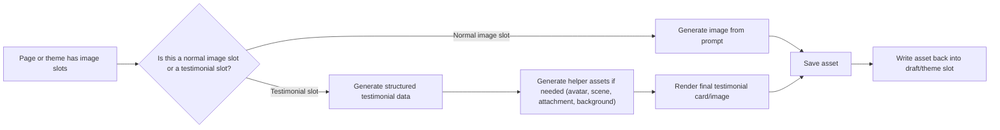

# Testimonial Service End to End

This document explains how the testimonial service works across the codebase in plain English.

It is written for marketers and operators, not engineers.

## The Short Version

There is not just one "testimonial path."

The system has several different image-generation paths:

1. Normal product/page images
2. Funnel testimonial images on pre-sales and sales pages
3. Sales PDP hero carousel images
4. Shopify theme review-card image slots
5. An older external swipe-based testimonial workflow

The important idea is this:

- Normal page images are generated like regular marketing images from prompts.
- Testimonial images are usually generated as structured review cards or social-style comment graphics.
- The renderer then turns that structured data into a finished PNG using fixed visual templates.

So the testimonial system is not just "make an image."
It is usually:

1. Decide which slots are testimonial slots
2. Generate believable review data
3. Generate any helper imagery needed for the testimonial
4. Render the final designed testimonial card
5. Save it as an asset
6. Write it back into the page or theme draft

## Key Terms

Before the paths, here are the few terms that matter:

- **Slot**: a placeholder where an image should go
- **Draft**: the current editable version of a page/theme
- **Asset**: a saved image file the system can reuse and publish
- **Renderer**: the service that takes structured review data and turns it into a designed testimonial image
- **Synthetic testimonial**: a testimonial generated by AI, not imported from a real customer source

## One Simple Mental Model

## The Main Paths At A Glance

| Path | What it is for | Main output style | Main engine |
| --- | --- | --- | --- |
| Normal product/page image path | Hero images, gallery images, supporting visuals | Regular AI marketing image | Prompt-based image generation |
| Funnel testimonial path | Pre-sales and sales page testimonial blocks | Review cards, social comments, testimonial media | Testimonial generator + testimonial renderer |
| Sales PDP carousel path | Sales PDP hero gallery | UGC-style carousel slides | Special PDP testimonial renderer flow |
| Shopify theme review-slot path | Shopify theme sections specifically marked as testimonial slots | Review-card graphics | Slot routing + testimonial renderer |
| External swipe workflow | Older sidecar workflow from zipped template images | Swipe-derived generated assets | Separate wrapper script |

## Default Funnel Run Order

When the in-app funnel generator runs on a template page, the order is usually:

1. Generate or update the draft
2. Generate normal non-testimonial images
3. Save the draft
4. Generate testimonial images
5. If the page is a Sales PDP, generate the special hero carousel last

That ordering matters because:

- testimonial generation works against a saved draft
- the Sales PDP carousel is treated as its own later step
- one step failing does not automatically mean the whole page had no earlier output

## Path 1: Normal Product/Page Images

This is the standard image path.

### What it is used for

- Hero images
- Gallery images
- Supporting images
- Most non-testimonial visual sections

### How it works

1. The page draft is created or updated.
2. The system scans the page for image slots that still need images.
3. It ignores slots already reserved for testimonials.
4. It builds prompts for those normal slots based on:
   - the slot role
   - the page copy
   - the product context
   - any slot-specific hints
5. It generates the image.
6. It stores the image as an asset.
7. It writes the asset ID back into the slot.

### Important behavior

- These images are prompt-driven.
- They are treated like normal marketing visuals, not social proof graphics.
- They can optionally use a reference image of the product to keep the product looking correct.
- If a slot is marked as testimonial-only, the normal image path is blocked from touching it.

### In marketer language

This is the "make me a product/lifestyle image for this section" path.

## Path 2: Funnel Testimonial Images

This is the main testimonial service for funnel pages.

It is used on the funnel templates that support testimonial blocks:

- `sales-pdp`
- `pre-sales-listicle`

### What makes this path different

Instead of generating a generic image prompt and calling it done, the system first creates structured testimonial content:

- reviewer name
- review text
- rating
- verified flag
- persona description
- avatar prompt
- hero-image prompt
- reply/comment data
- media prompts
- location/date metadata

Then it uses that structured data to render a finished testimonial image.

### End-to-end flow

1. The system loads the current page draft.
2. It figures out which template the page is using.
3. It scans the page for testimonial image targets.
4. It collects product context and page copy.
5. It also pulls in grounding context when available:
   - Strategy V2 outputs
   - brand/context documents
6. It asks the LLM to generate synthetic testimonials in a strict JSON shape.
7. It validates that output hard:
   - required fields must exist
   - names must be unique
   - review lengths must fit limits
   - reply identity must be different from the main reviewer
   - dates must be valid
8. For each testimonial slot, it decides which visual template to use.
9. If the chosen visual style needs helper imagery, it generates those helper assets.
10. It sends the finished payload into the testimonial renderer.
11. The renderer creates a final PNG using HTML/CSS templates in Playwright/Chromium.
12. The PNG is stored as an asset.
13. That asset is written back into the correct page slot.
14. The system saves a new draft version of the page.

### Where the testimonial text comes from

The review text is not pulled from a customer database.

Right now, this path is **synthetic only**. The code explicitly errors if you ask for a non-synthetic testimonial generation path.

That means:

- the testimonials are generated from the product/page context
- they are meant to sound grounded and believable
- they are not currently imported real reviews

### The three testimonial visual families

The funnel testimonial path can produce several styles.

#### 1. Review card

This is a classic testimonial card:

- reviewer name
- rating
- review text
- optional avatar
- optional lifestyle/hero image

Use this as the "clean review tile" path.

#### 2. Social comment

This looks more like a social thread or comment screenshot.

It can include:

- avatar
- comment text
- reactions
- reply thread
- optional attachment image

The system rotates between a few social variants so the wall does not look identical.

#### 3. Testimonial media

This is used for pre-sales layouts that expect multiple media images around the review.

In that case, the system generates:

- three media prompts
- three supporting scene images
- then renders those as testimonial media assets

### Special behavior inside this path

#### Review walls are intentionally mixed

For review-wall style sections, the system does not make every tile look the same.

It intentionally mixes:

- more social-comment style cards
- fewer review-card style tiles

This creates a more varied wall instead of a row of identical boxes.

#### Pre-sales review slides with 3 images are forced into media mode

If a pre-sales review slide expects three image objects, the service forces those to become `testimonial_media` slots.

In plain English:

- if the layout expects a media-rich testimonial, the service honors that layout
- it does not treat those three slots like random unrelated gallery images

#### Sales PDP hidden review walls can still matter

A hidden Sales PDP review wall can still be used as the source for other review-driven sections, especially the guarantee feed.

So "hidden" does not always mean "unused."

### What gets saved

The system saves:

- the final testimonial image asset
- metadata about how it was generated
- the new page draft with asset IDs inserted into the right slots

It also records provenance saying the testimonial source was synthetic.

## Path 3: Sales PDP Hero Carousel Images

This is a separate path, even though it also uses the testimonial renderer.

It is not the same thing as the review-wall/review-slider testimonial flow.

### What it is for

This path builds the Sales PDP hero gallery carousel.

The gallery has a special structure:

- **Slot 1** is the real core product image
- **The remaining slots** are rendered UGC-style testimonial/offer slides

### Why this path exists separately

These carousel slides are more like "social-proof product slides" than standard review tiles.

They use dedicated PDP templates such as:

- `pdp_ugc_standard`
- `pdp_bold_claim`
- `pdp_personal_highlight`

### End-to-end flow

1. The service loads the Sales PDP draft.
2. It finds the hero gallery slide slots.
3. It makes sure the gallery has the expected number of slides.
4. It loads product context and page copy.
5. It extracts shared banner copy from the page itself, including:
   - CTA text
   - price
   - review summary
6. It uses the real product/offer image for the core slot.
7. It asks the LLM for a structured 5-slide plan for the remaining carousel slots.
8. It validates that plan very tightly.
9. It builds background prompts using:
   - the actual product identity
   - sample guidance files
   - the brand/design system
10. It sends those slide payloads to the testimonial renderer.
11. It stores the finished PNGs as assets.
12. It writes those assets back into the hero gallery slides.
13. It saves a new draft version.

### Important difference from normal image generation

These carousel slides are **not** treated as free-form hero/gallery prompts.

The code explicitly strips out normal image-generation fields from these slots so generic image logic does not touch them.

In marketer language:

- the hero carousel is owned by a special social-proof renderer path
- not by the ordinary image-prompt path

## Path 4: Shopify Theme Review-Card Slots

This is the clearest "product page images vs testimonials" split in the Shopify theme workflow.

### What decides the route

The shared theme slot config contains the rule.

If a slot is marked like this:

- `generationStrategy: testimonial_renderer`
- `testimonialTemplate: review_card`

then that slot is sent through the testimonial path.

If not, it stays on the normal AI image path.

### What this means in practice

Inside one Shopify theme draft:

- hero/product/supporting slots go through normal image generation
- review-card slots go through testimonial payload generation + testimonial rendering

### End-to-end flow

1. The theme draft exposes a list of image slots.
2. The system filters to the slots selected for image generation.
3. For each slot, it checks the slot config.
4. If the slot is a testimonial review slot:
   - it generates a structured review-card payload
   - it renders the review card
   - it stores the result as an uploaded asset
5. If the slot is a normal slot:
   - it builds a standard prompt
   - it generates the image normally
   - it stores the result as an AI image asset
6. It updates the draft's `componentImageAssetMap` and resolved image URLs.
7. It stores metadata showing, per slot:
   - image model
   - image source
   - prompt token counts
   - errors, if any

### Why this is useful for marketers

It lets one theme have a mix of:

- polished product/brand visuals
- believable review-card graphics

without forcing every slot down the same generation path.

### Important limitation

In Shopify theme sync, routed testimonial slots currently support `review_card` only.

### Operational note

In theme sync, testimonial-slot failures and normal-slot failures are tracked per slot.

That means one review-card slot can fail while other normal product-image slots still succeed.

## Path 5: Older External Swipe Testimonial Workflow

There is also an older sidecar workflow documented in `docs/swipe-testimonial-workflow.md`.

This is different from the main in-app testimonial service.

### What it does

It:

1. extracts testimonial/template images from a zip
2. serves them locally
3. sends those images into the existing swipe image workflow
4. persists the generated assets
5. writes the resulting asset IDs back into a page draft

### Why it matters

This path is more of a wrapper around the swipe-generation system.

It is useful if someone asks:

"Can we take a batch of existing testimonial-like templates and run them through the swipe pipeline?"

That is not the same as the current testimonial renderer flow used in the app.

## The Biggest Difference: Product Page Images vs Testimonial Images

This is the most important distinction.

### Normal product/page image path

- Starts with an image slot
- Builds a prompt for that slot
- Generates a normal image
- Saves it
- Writes it back

### Testimonial image path

- Starts with a testimonial-designated slot
- Generates structured review data first
- May generate helper assets like avatar/scene/attachment/background
- Renders the final layout through a testimonial template
- Saves that rendered PNG
- Writes it back

### In plain English

Normal page images are "create the picture."

Testimonial images are "create the review story, then design the review graphic."

## What Gets Written Back Into The Page

When the process succeeds, the service usually writes asset IDs back into image slots, not raw temporary URLs.

That is important because:

- the page/theme draft now points at stored assets
- those assets can be published later
- the final page is not depending on a temporary generation response

For Sales PDP flows, the service also syncs related review content:

- review wall images
- review slider media
- guarantee section feed images
- structured review data shown in the reviews component

## Important Guardrails And Business Rules

These are the parts a marketer should know because they affect outcomes.

### 1. Synthetic testimonials are blocked from production publishing by default

If the environment is production and synthetic testimonials are not explicitly allowed, the system blocks publishing.

Meaning:

- you can generate them in drafts
- but production publishing can be stopped until they are replaced or the environment explicitly allows them

### 2. A product primary image is required for many testimonial flows

The testimonial system often uses the real product image as grounding for hero/attachment/background generation.

If the product does not have a ready primary image, important testimonial flows will fail cleanly.

### 3. Sales PDP review data is intentionally larger than visible image slots

For Sales PDP pages, the system can generate a larger testimonial/review dataset than the number of visible testimonial image slots.

There is a minimum review count rule for Sales PDP review data so the reviews module looks populated and realistic.

In practical terms:

- visible testimonial cards are one thing
- the full reviews dataset is another thing

### 4. The system prefers explicit errors over silent fallback behavior

This repo is set up to fail clearly when required testimonial inputs are missing or a route is unsupported.

That is good operationally because you see what went wrong instead of getting a silent low-quality substitute.

## Where A Marketer Should Expect Variation

The system does add controlled variation so pages do not look cloned.

Examples:

- mixed review-card and social-comment walls
- rotating social-comment visual variants
- different personas, scenes, and reply voices
- different Sales PDP carousel slide archetypes

This variation is deliberate.

It is there to avoid pages looking like the same testimonial repeated over and over.

## Where A Marketer Should Not Expect Variation

Some areas are intentionally constrained:

- Shopify review slots stay on `review_card`
- Sales PDP carousel has a fixed slot structure
- testimonial JSON must fit strict validation
- product identity is meant to stay tied to the real product reference

In other words:

- copy can vary
- persona can vary
- scene can vary
- but the structural rules are tight

## Typical Failure Modes

If the service breaks, the likely reasons are:

- no product context
- no product primary image
- testimonial slot structure is malformed
- renderer cannot start or times out
- unsupported template type
- invalid generated testimonial JSON
- production publish blocked because testimonials are synthetic

These are usually hard failures, not silent substitutions.

## Practical Summary

If you remember only three things, remember these:

1. **Standard images and testimonial images are different pipelines.**
   Normal images are prompt-to-image. Testimonial images are structured-review-to-rendered-card.

2. **Sales PDP has two testimonial-like systems.**
   One is for review wall/slider/guarantee content, and another separate one builds the hero carousel.

3. **Shopify theme sync uses slot routing.**
   Some slots are normal AI image slots, while specific review slots are explicitly routed to the testimonial renderer.

## Recommended Mental Model For Non-Technical Teams

When you ask "How will this image be made?" use this checklist:

1. Is it a normal brand/product image slot?
2. Is it a testimonial/review slot?
3. Is it part of the Sales PDP hero carousel?
4. Is it in Shopify theme sync and marked for testimonial rendering?

If you answer those four questions, you can usually predict which branch the system will take.
