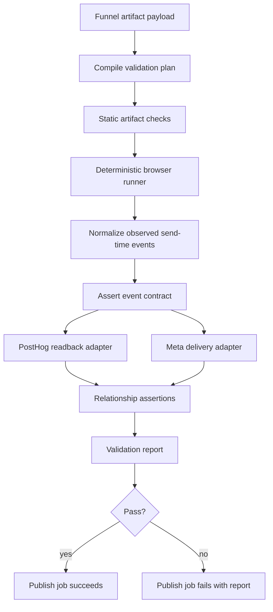

# Option 2 Detailed Design: Schema-Driven Deterministic html-deploy-v1 Validator

Decision: implement the deterministic validator as a first-class MOS backend package, invoked by the existing publish/deploy job. This keeps validation close to the artifact compiler, publish metadata, secrets, and deploy lifecycle, while separating validation logic from the current monolithic deploy service.

This document expands Option 2 from [html-deploy-v1-deterministic-validator-design.md](./html-deploy-v1-deterministic-validator-design.md) and implements the requirements in [html-deploy-v1-page-validation-spec.md](./html-deploy-v1-page-validation-spec.md).

## Executive Summary

The deterministic validator should turn the `html-deploy-v1` manifest into a compiled validation contract, execute the exact declared path in a browser, validate outbound payloads, and prove destination receipt.

The validator must prove four things before an HTML funnel page is production-valid:

1. The artifact is structurally valid and has the correct `html-deploy-v1` instrumentation contract.
2. The browser runtime can send the required PostHog, Meta, and MOS internal calls with exact event names and required attributes.
3. PostHog receives the required events with the expected attributes after ingestion.
4. Meta receives the expected browser Pixel events directly, with optional Meta test-event confirmation when credentials are configured.

This directly prevents the regressions we saw:

- sales pages emitting only `sales_page_view` without PostHog `EnteredSales`;
- presales-to-sales clicks missing RMBC bridge values;
- quiz final CTAs reaching sales without deterministic quiz and bridge validation;
- route-scoped artifact swaps bypassing the latest `html-deploy-v1` harness contract.

## Design Principles

- **Spec-driven, not heuristic-driven.** The page type contract determines required events, fields, ordering, and relationships.
- **Fail closed.** Missing config, unsupported page type, missing selector, missing event, or missing destination receipt fails validation with a clear error.
- **Destination proof matters.** Browser-side send intent is insufficient. PostHog readback is required when configured; direct Meta Pixel network delivery must be recorded and validated.
- **Contracts are data.** Adding a future page type should require adding a contract, not editing many branches inside deploy code.
- **Deterministic paths.** Browser actions should come from manifest-declared selectors and validation flows.
- **Human-reviewable evidence.** Every validation run emits a compact report with phase status, observed events, and failure reasons.

## Package Layout

Create a dedicated backend package:

```text
mos/backend/app/services/html_deploy_validation/
  __init__.py
  models.py
  registry.py
  compiler.py
  static_checks.py
  browser_runner.py
  event_capture.py
  assertions.py
  report.py
  orchestrator.py
  destinations/
    __init__.py
    posthog.py
    meta.py
```

`mos/backend/app/services/deploy.py` should keep only orchestration hooks:

```python
from app.services.html_deploy_validation.orchestrator import run_html_deploy_validation

validation_report = run_html_deploy_validation(
    artifact_payload=artifact_payload,
    funnel_id=funnel_id,
    publication_id=publication_id,
    access_urls=access_urls,
    render_mode=render_mode,
)
```

The deploy service should not own page-type-specific rules after extraction.

## High-Level Flow



## Core Data Models

### Validation Plan

The compiler produces a plan before any browser execution.

```python
class HtmlDeployValidationPlan(BaseModel):
    schema_version: Literal["html-deploy-validator-v1"]
    validation_id: str
    origin: str
    render_mode: Literal["html_deploy"]
    product_slug: str
    funnel_slug: str
    publication_id: str
    pages: list[CompiledPage]
    paths: list[CompiledValidationPath]
    tracking: TrackingConfig
    settings: ValidatorSettings
```

### Compiled Page

```python
class CompiledPage(BaseModel):
    page_id: str
    slug: str
    url: str
    stage: Literal["pre_sales", "sales", "checkout", "thank_you", "custom"]
    artifact_kind: Literal["listicle", "listicle_hybrid", "quiz", "sales"]
    manifest: HtmlDeployInstrumentationManifest
    tracking: TrackingConfig
```

### Compiled Validation Path

Each path is deterministic and executable.

```python
class CompiledValidationPath(BaseModel):
    path_id: str
    path_kind: Literal["listicle_to_sales", "quiz_to_sales", "direct_sales"]
    start_page: CompiledPage
    sales_page: CompiledPage
    actions: list[BrowserAction]
    event_requirements: list[EventRequirement]
    relationship_assertions: list[RelationshipAssertion]
    forbidden_event_assertions: list[ForbiddenEventAssertion]
```

### Browser Actions

```python
class BrowserAction(BaseModel):
    action: Literal[
        "goto",
        "click",
        "wait_for_url",
        "wait_for_event",
        "assert_no_event_before_event",
        "execute_quiz_flow",
        "scroll"
    ]
    selector: str | None = None
    url: str | None = None
    event_name: str | None = None
    timeout_ms: int = 30000
    params: dict[str, Any] = Field(default_factory=dict)
```

### Event Requirement

```python
class EventRequirement(BaseModel):
    requirement_id: str
    logical_event: str
    destinations: list[Literal["mos_internal", "posthog_send", "posthog_readback", "meta_send", "meta_delivery"]]
    event_names: dict[str, str]
    required_props: list[PropAssertion]
    optional_props: list[str] = Field(default_factory=list)
    allow_extra_props: bool = True
```

Example:

```yaml
requirement_id: sales_entered_sales_posthog
logical_event: sales_entry
destinations:
  - posthog_send
  - posthog_readback
event_names:
  posthog: EnteredSales
required_props:
  - path: page_stage
    op: equals
    value: sales
  - path: content_category
    op: in
    value: [sales, sales_page]
  - path: session_id
    op: exists
  - path: visitor_id
    op: exists
```

### Relationship Assertion

Relationship assertions compare events to one another.

```python
class RelationshipAssertion(BaseModel):
    assertion_id: str
    left_event: EventSelector
    left_prop: str
    op: Literal["equals", "url_query_equals", "url_query_exists", "occurs_before"]
    right_event: EventSelector | None = None
    right_prop: str | None = None
    expected_value: str | None = None
```

Example:

```yaml
assertion_id: sales_page_view_stitches_to_presales_click_session
left_event:
  destination: posthog_readback
  event_name: sales_page_view
left_prop: rmbc_session_id
op: equals
right_event:
  destination: posthog_readback
  event_name: PreSalesToSalesClick
right_prop: rmbc_session_id
```

### Observed Event

All browser-captured and destination-readback events normalize into this shape.

```python
class ObservedEvent(BaseModel):
    source: Literal[
        "mos_internal_send",
        "posthog_send",
        "posthog_readback",
        "meta_send",
        "meta_delivery"
    ]
    event_name: str
    validation_id: str | None
    event_id: str | None
    url: str | None
    props: dict[str, Any]
    response_status: int | None = None
    response_ok: bool | None = None
    raw_ref: str | None = None
    observed_at: datetime
```

## Contract Registry

The validator should expose a registry keyed by `htmlArtifactKind`.

```python
HTML_DEPLOY_CONTRACT_REGISTRY = {
    "listicle": build_listicle_contract,
    "listicle_hybrid": build_listicle_contract,
    "quiz": build_quiz_contract,
    "sales": build_sales_contract,
}
```

Each contract builder receives compiled page metadata and returns:

- required manifest bindings;
- browser actions;
- event requirements;
- relationship assertions;
- forbidden event assertions.

Unsupported artifact kinds fail during plan compilation.

## Page Type Contracts

### Listicle And Listicle Hybrid

`listicle` and `listicle_hybrid` share the same contract.

Required manifest:

- `schemaVersion = html-deploy-v1`
- `pageStage = pre_sales`
- `htmlArtifactKind in ["listicle", "listicle_hybrid"]`
- at least one `internal_navigation` binding targeting the sales page
- binding has deterministic `selector`
- binding has `trackEventType = pre_sales_to_sales_click`

Browser actions:

```yaml
- action: goto
  url: start_page.url_with_validation_id
- action: wait_for_event
  event_name: EnteredPresales
- action: click
  selector: internal_navigation.selector
- action: wait_for_url
  url: sales_page.url
- action: wait_for_event
  event_name: sales_page_view
- action: click
  selector: checkout.selector
- action: wait_for_event
  event_name: SalesToCheckoutClick
```

Required PostHog readback:

```text
presell_page_view
EnteredPresales
cta_click
PreSalesToSalesClick
sales_page_view
EnteredSales
SalesToCheckoutClick
SalesToCheckoutClicked
```

Required Meta delivery:

```text
PageView
EnteredPresales
PreSalesToSalesClick
PageView
EnteredSales
ViewContent
SalesToCheckoutClick
SalesToCheckoutClicked
```

Bridge relationships:

```text
PreSalesToSalesClick.destination_url contains rmbc_session_id
PreSalesToSalesClick.destination_url contains rmbc_anonymous_id
PreSalesToSalesClick.destination_url contains rmbc_click_id
sales_page_view.rmbc_session_id == PreSalesToSalesClick.rmbc_session_id
sales_page_view.rmbc_anonymous_id == PreSalesToSalesClick.rmbc_anonymous_id
sales_page_view.rmbc_click_id == PreSalesToSalesClick.rmbc_click_id
EnteredSales.rmbc_session_id == PreSalesToSalesClick.rmbc_session_id
EnteredSales.rmbc_anonymous_id == PreSalesToSalesClick.rmbc_anonymous_id
EnteredSales.rmbc_click_id == PreSalesToSalesClick.rmbc_click_id
```

### Quiz

Required manifest:

- `schemaVersion = html-deploy-v1`
- `pageStage = pre_sales`
- `htmlArtifactKind = quiz`
- final CTA binding targets sales page
- quiz validation flow is declared, or transitional Heyflow compatibility driver is available

Recommended manifest addition:

```json
{
  "validationFlow": {
    "type": "quiz",
    "driver": "declared_steps",
    "steps": [
      {
        "selector": "[data-rmbc-question='q1'] [data-rmbc-option='a']",
        "action": "click"
      },
      {
        "selector": "[data-rmbc-question='q1'] [data-rmbc-next]",
        "action": "click"
      }
    ],
    "finalCtaSelector": "[data-tenor-final-cta]"
  }
}
```

Browser actions:

```yaml
- action: goto
  url: quiz.url_with_validation_id
- action: wait_for_event
  event_name: QuizLeadViewed
- action: execute_quiz_flow
  params:
    flow: manifest.validationFlow
- action: wait_for_event
  event_name: QuizResultViewed
- action: wait_for_event
  event_name: QuizCtaViewed
- action: assert_no_event_before_event
  params:
    forbidden_event: EnteredSales
    before_event: sales_page_view
- action: click
  selector: validationFlow.finalCtaSelector
- action: wait_for_url
  url: sales_page.url
- action: wait_for_event
  event_name: sales_page_view
- action: click
  selector: checkout.selector
- action: wait_for_event
  event_name: SalesToCheckoutClick
```

Required PostHog readback:

```text
EnteredPresales
QuizLeadViewed
QuizQuestionViewed
QuizOptionSelected
QuizCompleted
QuizResultViewed
QuizCtaViewed
PreSalesToSalesClick
sales_page_view
EnteredSales
SalesToCheckoutClick
SalesToCheckoutClicked
```

Required Meta delivery:

```text
PageView
EnteredPresales
PreSalesToSalesClick
PageView
EnteredSales
ViewContent
SalesToCheckoutClick
SalesToCheckoutClicked
```

Forbidden event assertion:

```text
EnteredSales must not occur before sales_page_view.
```

Quiz bridge fields:

```text
rmbc_session_id
rmbc_anonymous_id
rmbc_click_id
rmbc_quiz_id
rmbc_quiz_version
rmbc_quiz_variant
rmbc_result_id
rmbc_segment_id
rmbc_offer_id
rmbc_answer_path_hash
session_id
anonymous_id
click_id
click_id_type=rmbc_click_id
bridge_click_id
src=presale
from=quiz
from_stage=pre_sales
to_stage=sales
source_page=quiz
source_page_type=quiz_presell
mos_session_id
mos_visitor_id
```

### Sales

Required manifest:

- `schemaVersion = html-deploy-v1`
- `pageStage = sales`
- `htmlArtifactKind = sales`
- at least one checkout binding
- checkout binding has deterministic selector

Browser actions:

```yaml
- action: goto
  url: sales.url_with_validation_id
- action: wait_for_event
  event_name: sales_page_view
- action: wait_for_event
  event_name: EnteredSales
- action: click
  selector: checkout.selector
- action: wait_for_event
  event_name: SalesToCheckoutClick
```

Required PostHog readback:

```text
sales_page_view
EnteredSales
SalesToCheckoutClick
SalesToCheckoutClicked
```

Required Meta delivery:

```text
PageView
EnteredSales
ViewContent
SalesToCheckoutClick
SalesToCheckoutClicked
```

Sales event context:

```text
product_slug
funnel_slug
publication_id
page_id
page_slug
page_stage=sales
content_category=sales_page
session_id
visitor_id
```

## Validation Phases In Detail

### Phase 1: Compile

Responsibility:

- Parse artifact payload.
- Locate the published funnel by `funnel_id` and `publication_id`.
- Extract pages, manifests, links, tracking config, and URLs.
- Resolve page type contracts from the registry.
- Compile browser actions and event assertions.

Inputs:

- `artifact_payload`
- `funnel_id`
- `publication_id`
- `access_urls`
- `render_mode`

Outputs:

- `HtmlDeployValidationPlan`

Failure cases:

- render mode is not `html_deploy`;
- missing public access URL;
- missing sales page;
- multiple sales pages in one validation path;
- missing instrumentation manifest;
- unsupported `htmlArtifactKind`;
- invalid page stage for artifact kind;
- missing required binding;
- inconsistent tracking config across path pages.

### Phase 2: Static Checks

Responsibility:

- Fetch deployed HTML for each page.
- Verify forbidden strings are absent.
- Verify PostHog and Meta bootstrap config.
- Verify direct Meta Pixel usage.
- Reject MOS Meta proxy paths.
- Verify public asset and image references.

Static checks should use deterministic parsers:

- `HTMLParser` for `img/src`, `img/srcset`, `source/srcset`.
- URL parser for route-local and public asset references.
- manifest parser for instrumentation config.

Failure cases:

- missing image asset;
- missing direct Meta script reference;
- MOS Meta proxy reference;
- PostHog bootstrap missing configured key or host;
- legacy Mars or MenGoToMars references;
- missing manifest.

### Phase 3: Browser Execution

Responsibility:

- Launch Playwright.
- Install tracking interception script.
- Execute compiled browser actions.
- Capture outbound payloads and responses.
- Return normalized send-time events.

Browser execution must not infer page behavior when the manifest declares it.

Allowed transitional inference:

- Heyflow quiz driver for existing quiz artifacts without `validationFlow`.

Required eventual behavior:

- new quiz artifacts must declare `validationFlow`;
- future page types must declare deterministic validation actions.

### Phase 4: Send-Time Assertion

Responsibility:

- Verify the page attempted every required send.
- Verify exact event names.
- Verify exact required props.
- Verify response status for MOS internal events and direct Meta Pixel sends.
- Verify forbidden events did not fire before allowed conditions.

This phase proves the artifact can send the calls correctly.

It does not prove destination receipt by itself.

### Phase 5: PostHog Readback

Responsibility:

- Query PostHog by unique validation id.
- Poll until required events are visible or timeout.
- Normalize readback rows to `ObservedEvent`.
- Re-run event and relationship assertions against readback events.

Validation id should be propagated through:

```text
mos_deploy_validation_id
utm_campaign
utm_content
fbclid
$current_url
event_source_url
destination_url
url_params
```

HogQL query scope:

```sql
select
  event,
  timestamp,
  properties['$current_url'] as current_url,
  properties.event_source_url as event_source_url,
  properties.destination_url as destination_url,
  properties.url_params as url_params,
  properties.utm_content as utm_content,
  properties.utm_campaign as utm_campaign,
  properties.content_category as content_category,
  properties.page_stage as page_stage,
  properties.pageStage as pageStage
from events
where timestamp > now() - interval 2 hour
  and (
    position(toString(properties['$current_url']), '<validation_id>') > 0
    or position(toString(properties.event_source_url), '<validation_id>') > 0
    or position(toString(properties.destination_url), '<validation_id>') > 0
    or position(toString(properties.url_params), '<validation_id>') > 0
    or position(toString(properties.utm_content), '<validation_id>') > 0
    or position(toString(properties.utm_campaign), '<validation_id>') > 0
  )
order by timestamp asc
limit 1000
```

Failure cases:

- missing `EnteredSales`;
- missing `SalesToCheckoutClicked`;
- missing quiz events;
- sales event lacks `content_category=sales_page`;
- downstream sales events do not preserve RMBC bridge fields.

### Phase 6: Meta Delivery

Responsibility:

- Verify Meta events are emitted through direct Meta Pixel network requests.
- Verify direct Meta Pixel response status is successful.
- Verify event names and payload custom data.
- Optionally confirm event receipt through Meta test-event tooling when credentials are configured.

Required baseline:

```text
meta_delivery_proof=direct_pixel_network
```

Optional strict mode:

```text
meta_delivery_proof=meta_test_event_confirmed
```

Recommended config:

```text
DEPLOY_TRACKING_VALIDATION_REQUIRE_META_DELIVERY=true
DEPLOY_TRACKING_VALIDATION_REQUIRE_META_TEST_EVENT_CONFIRMATION=false
DEPLOY_TRACKING_VALIDATION_META_TEST_EVENT_CODE=<optional secret>
DEPLOY_TRACKING_VALIDATION_META_ACCESS_TOKEN=<optional secret>
```

Failure cases:

- Meta event uses a MOS proxy path;
- direct Meta Pixel request is missing or returns non-2xx;
- `EnteredSales` lacks sales `event_source_url`;
- `SalesToCheckoutClick` lacks value, currency, or CTA fields;
- strict Meta test-event mode cannot confirm receipt.

### Phase 7: Relationship Assertions

Responsibility:

- Validate relationships across event streams.
- Compare send-time and readback events where useful.
- Fail on broken stitching.

Core relationship assertions:

```text
PreSalesToSalesClick.destination_url contains rmbc_session_id
PreSalesToSalesClick.destination_url contains rmbc_anonymous_id
PreSalesToSalesClick.destination_url contains rmbc_click_id
sales_page_view.rmbc_session_id == PreSalesToSalesClick.rmbc_session_id
EnteredSales.rmbc_session_id == PreSalesToSalesClick.rmbc_session_id
EnteredSales occurs after sales_page_view
EnteredSales does not occur before sales_page_view
SalesToCheckoutClick occurs after sales_page_view
```

## Destination Adapters

### PostHog Adapter

File:

```text
mos/backend/app/services/html_deploy_validation/destinations/posthog.py
```

Interface:

```python
class PostHogReadbackAdapter:
    def __init__(self, *, api_key: str, ui_host: str, timeout_seconds: float, poll_seconds: float): ...

    def read_events(self, *, validation_id: str) -> list[ObservedEvent]: ...

    def wait_for_events(
        self,
        *,
        validation_id: str,
        requirements: list[EventRequirement],
        assertions: list[RelationshipAssertion],
    ) -> DestinationValidationResult: ...
```

Config:

```text
DEPLOY_TRACKING_VALIDATION_REQUIRE_POSTHOG_READBACK=true
DEPLOY_TRACKING_VALIDATION_POSTHOG_READBACK_API_KEY=<secret>
DEPLOY_TRACKING_VALIDATION_POSTHOG_READBACK_TIMEOUT_SECONDS=120
DEPLOY_TRACKING_VALIDATION_POSTHOG_READBACK_POLL_SECONDS=7
```

Behavior:

- no API key and readback required -> fail;
- no API key and readback not required -> skip with report status `skipped`;
- query errors -> fail with HTTP status and sanitized body;
- timeout -> fail with observed events list.

### Meta Adapter

File:

```text
mos/backend/app/services/html_deploy_validation/destinations/meta.py
```

Interface:

```python
class MetaDeliveryAdapter:
    def validate_proxy_delivery(
        self,
        *,
        observed_events: list[ObservedEvent],
        requirements: list[EventRequirement],
    ) -> DestinationValidationResult: ...

    def validate_test_event_receipt(
        self,
        *,
        validation_id: str,
        pixel_id: str,
    ) -> DestinationValidationResult: ...
```

Baseline proof:

- browser request to Meta Pixel endpoints;
- event name parsed from request;
- custom data parsed from request body/query;
- response status is 2xx.

Optional strict proof:

- add validation `test_event_code`;
- query Meta test events when API support is configured;
- require confirmation for expected event names.

## Deterministic Quiz Flow

The biggest future-proofing gap is quiz interaction. The current validator can drive Heyflow heuristically, but that is not deterministic enough long term.

Required manifest extension:

```json
{
  "validationFlow": {
    "type": "quiz",
    "version": 1,
    "steps": [
      {
        "id": "q1-answer",
        "selector": "[data-rmbc-question='q1'] [data-rmbc-option='a']",
        "action": "click",
        "expectEvent": "QuizOptionSelected"
      },
      {
        "id": "q1-next",
        "selector": "[data-rmbc-question='q1'] [data-rmbc-next]",
        "action": "click",
        "expectEvent": "QuizQuestionSubmitted"
      }
    ],
    "finalCtaSelector": "[data-tenor-final-cta]",
    "expectedResultId": "unmapped"
  }
}
```

Migration path:

1. Existing quiz artifacts may use `driver=heyflow_compat`.
2. New quiz artifacts must declare `validationFlow`.
3. After migration, `heyflow_compat` becomes test-only and production deploys require declared flow.

## Error Model

Use typed failures internally.

```python
class ValidationFailure(BaseModel):
    phase: Literal["compile", "static", "browser_send", "posthog_readback", "meta_delivery", "relationships"]
    severity: Literal["error", "warning"]
    page_url: str | None
    event_name: str | None
    destination: str | None
    assertion_id: str | None
    message: str
    expected: Any | None = None
    observed: Any | None = None
```

The deploy job should surface the first few errors in a concise summary and persist the full report.

Example:

```text
html-deploy-v1 validation failed.
phase=posthog_readback
path=listicle_to_sales
event=EnteredSales
message=Missing PostHog readback event for validation id deploy-validation-abc.
observed=sales_page_view, SalesToCheckoutClick
```

## Report Schema

```python
class HtmlDeployValidationReport(BaseModel):
    schema_version: Literal["html-deploy-validator-report-v1"]
    validation_id: str
    status: Literal["passed", "failed"]
    origin: str
    render_mode: str
    artifact_kinds: list[str]
    started_at: datetime
    completed_at: datetime
    paths: list[PathValidationReport]
    phases: dict[str, PhaseReport]
    observed_events: list[ObservedEvent]
    failures: list[ValidationFailure]
```

Path report:

```python
class PathValidationReport(BaseModel):
    path_id: str
    path_kind: str
    start_url: str
    sales_url: str
    status: Literal["passed", "failed"]
    executed_actions: list[ExecutedAction]
    posthog_readback: DestinationValidationResult | None
    meta_delivery: DestinationValidationResult | None
```

The report should be stored in the publish job result:

```json
{
  "deploy": {
    "trackingValidation": {
      "schemaVersion": "html-deploy-validator-report-v1",
      "status": "passed",
      "validationId": "deploy-validation-..."
    }
  }
}
```

## Configuration

Add settings:

```python
DEPLOY_TRACKING_VALIDATION_ENABLED: bool = True
DEPLOY_TRACKING_VALIDATION_REQUIRE_POSTHOG_READBACK: bool = True
DEPLOY_TRACKING_VALIDATION_POSTHOG_READBACK_API_KEY: str | None = None
DEPLOY_TRACKING_VALIDATION_POSTHOG_READBACK_TIMEOUT_SECONDS: float = 120.0
DEPLOY_TRACKING_VALIDATION_POSTHOG_READBACK_POLL_SECONDS: float = 7.0
DEPLOY_TRACKING_VALIDATION_REQUIRE_META_DELIVERY: bool = True
DEPLOY_TRACKING_VALIDATION_REQUIRE_META_TEST_EVENT_CONFIRMATION: bool = False
DEPLOY_TRACKING_VALIDATION_META_TEST_EVENT_CODE: str | None = None
DEPLOY_TRACKING_VALIDATION_META_ACCESS_TOKEN: str | None = None
DEPLOY_TRACKING_VALIDATION_QUIZ_COMPAT_DRIVER_ENABLED: bool = True
```

Production recommendation:

```text
DEPLOY_TRACKING_VALIDATION_ENABLED=true
DEPLOY_TRACKING_VALIDATION_REQUIRE_POSTHOG_READBACK=true
DEPLOY_TRACKING_VALIDATION_REQUIRE_META_DELIVERY=true
DEPLOY_TRACKING_VALIDATION_REQUIRE_META_TEST_EVENT_CONFIRMATION=false
```

## Integration With Deploy Jobs

Current deploy flow should become:

```text
build artifact payload
deploy artifact
purge CDN
run deterministic validator
persist validation report
mark job succeeded only if validator passes
```

Important: validation must run after CDN purge so the public route reflects the deployed artifact.

If validation fails:

- do not mark deploy as production-valid;
- preserve backup/rollback metadata;
- include report path and top failures in job result;
- do not silently retry with legacy deploy paths.

## CI Integration

CI should run deterministic validator unit and mocked integration tests.

CI should not require live PostHog or Meta credentials. Destination adapters should support mocked clients.

CI test categories:

- contract compile tests;
- static HTML parser tests;
- browser runner tests with local fixture pages;
- PostHog adapter tests with fake HogQL responses;
- Meta adapter tests with fake proxy responses;
- relationship assertion tests;
- report schema snapshot tests.

Post-deploy production validation uses real PostHog/Meta settings.

## Test Matrix

### Unit Tests

| Area | Required tests |
|---|---|
| Registry | unsupported artifact kind fails; known types compile |
| Manifest | wrong stage fails; missing schema fails; missing binding fails |
| Static checks | forbidden references fail; srcset missing asset fails |
| Event assertions | missing required prop fails; wrong value fails |
| Relationships | missing bridge field fails; mismatched bridge value fails |
| PostHog adapter | polls until event lands; timeout fails with observed events |
| Meta adapter | non-2xx proxy response fails; missing event custom data fails |

### Fixture Integration Tests

Create local HTML fixtures:

```text
tests/fixtures/html_deploy/listicle_valid/
tests/fixtures/html_deploy/listicle_missing_bridge/
tests/fixtures/html_deploy/quiz_valid/
tests/fixtures/html_deploy/quiz_entered_sales_early/
tests/fixtures/html_deploy/sales_valid/
tests/fixtures/html_deploy/sales_missing_entered_sales/
tests/fixtures/html_deploy/sales_missing_checkout_clicked/
```

Each fixture should run through the browser runner with mocked destinations.

### Production Smoke Tests

Run against a staging route:

- listicle -> sales;
- quiz -> sales;
- direct sales.

Smoke test must produce a real PostHog readback report and direct Meta Pixel delivery report.

## Rollout Plan

### PR 1: Extract Without Behavior Change

- Create package.
- Move current functions out of `deploy.py`.
- Keep current assertions and report shape.
- Tests remain green.

### PR 2: Contract Registry

- Add `HtmlDeployPageContract`.
- Register listicle, listicle_hybrid, quiz, sales.
- Compile page-specific requirements from contracts.
- Add unit tests for contract compile failures.

### PR 3: Normalized Events And Assertion Engine

- Normalize send-time and readback events.
- Implement prop assertions.
- Implement relationship assertions.
- Replace bespoke bridge checks with data-driven assertions.

### PR 4: Destination Adapters

- Add PostHog readback adapter.
- Add direct Meta Pixel delivery adapter.
- Add optional Meta test-event adapter interface.
- Add mocked adapter tests.

### PR 5: Deterministic Quiz Validation Flow

- Add `validationFlow` manifest schema.
- Add declared quiz-flow runner.
- Keep Heyflow compatibility behind setting.
- Add migration warning for existing artifacts.

### PR 6: Enforce In Production

- Require PostHog readback in production.
- Require direct Meta Pixel delivery in production.
- Store validation report in publish job.
- Fail deploy jobs on validator failure.

## Migration For Current Pages

### Existing Listicle/Listicle Hybrid

Required work:

- confirm `htmlArtifactKind`;
- confirm internal navigation binding;
- confirm sales destination target;
- confirm checkout binding on sales page.

### Existing Quiz

Required work:

- keep Heyflow compatibility initially;
- add declared `validationFlow` to future quiz exports;
- add final CTA selector to manifest;
- ensure quiz bridge fields are emitted into destination URL.

### Existing Sales

Required work:

- ensure `sales_page_view` and PostHog `EnteredSales` are both emitted;
- ensure checkout emits `SalesToCheckoutClick` and `SalesToCheckoutClicked`;
- ensure sales context fields are present.

## Risk Analysis

### Risk: PostHog Ingestion Delay Causes False Failure

Mitigation:

- bounded polling;
- show observed events in failure;
- configurable timeout;
- validation token scoped to two-hour window.

### Risk: Meta Receipt Is Hard To Prove

Mitigation:

- require direct Meta Pixel network delivery proof immediately;
- support Meta test-event confirmation as strict mode;
- clearly label proof level in report.

### Risk: Quiz Flow Is Too Dynamic

Mitigation:

- use declared `validationFlow`;
- temporary Heyflow compatibility driver;
- fail new artifacts without declared flow after migration.

### Risk: Future Page Types Create Branching Again

Mitigation:

- registry-based contracts;
- assertion engine uses generic rules;
- no page-type logic inside deploy orchestration.

## Acceptance Criteria

The implementation is complete when:

- `deploy.py` invokes a dedicated `html_deploy_validation` orchestrator.
- `listicle`, `listicle_hybrid`, `quiz`, and `sales` contracts are registered.
- unsupported `htmlArtifactKind` fails compile.
- missing bridge fields fail validation.
- missing PostHog `EnteredSales` fails validation.
- missing `SalesToCheckoutClicked` fails validation.
- `EnteredSales` before sales load fails quiz validation.
- PostHog readback is required and proven in production config.
- direct Meta Pixel delivery is required and proven in production config.
- validation report is persisted in publish job result.
- no production HTML funnel deploy path can bypass `html-deploy-v1`.

## Implementation Checklist

- [ ] Add `html_deploy_validation` package.
- [ ] Move current validation code from `deploy.py`.
- [ ] Add Pydantic models for plans, contracts, events, reports, and failures.
- [ ] Add contract registry.
- [ ] Implement listicle/listicle_hybrid contract.
- [ ] Implement quiz contract.
- [ ] Implement sales contract.
- [ ] Implement static checks module.
- [ ] Implement deterministic browser runner.
- [ ] Implement event normalizer.
- [ ] Implement assertion engine.
- [ ] Implement PostHog adapter.
- [ ] Implement Meta adapter.
- [ ] Add report persistence.
- [ ] Wire validator into publish job.
- [ ] Add fixture integration tests.
- [ ] Add production config documentation.

## Open Questions

1. Should Meta test-event confirmation be required for production once credentials are available, or should proxy-forward proof remain sufficient?
2. How long should existing quiz artifacts be allowed to use the Heyflow compatibility driver?
3. Should validation reports be persisted only inside publish jobs, or as first-class artifacts for dashboard/history queries?
4. Should deploy validation run against every public access URL, or only the canonical URL plus CDN-purged route?
