# Database Schema

Database schema defined in `app/db/models.py` with PostgreSQL + SQLAlchemy models. All timestamps use timezone-aware columns with `server_default=now()`. Arrays default to empty (`'{}'::text[]`) and JSON fields default to `{}` when specified.

## ER diagram (tables + attributes)

```mermaid
erDiagram
    ORGS {
        uuid id PK
        text external_id
        text name
        timestamptz created_at
    }

    USERS {
        uuid id PK
        uuid org_id FK
        text clerk_user_id
        citext email
        user_role role
        timestamptz created_at
    }

    CLIENTS {
        uuid id PK
        uuid org_id FK
        text name
        text industry
        text[] primary_markets
        text[] primary_languages
        client_status status
        timestamptz created_at
    }

    PRODUCT_OFFERS {
        uuid id PK
        uuid org_id FK
        uuid client_id FK
        text name
        text description
        text business_model
        text[] differentiation_bullets
        text guarantee_text
        timestamptz created_at
    }

    PRODUCT_OFFER_PRICE_POINTS {
        uuid id PK
        uuid offer_id FK
        text label
        int amount_cents
        char(3) currency
    }

    CAMPAIGNS {
        uuid id PK
        uuid org_id FK
        uuid client_id FK
        text name
        campaign_status status
        text goal_description
        text objective_type
        numeric numeric_target
        numeric baseline
        int timeframe_days
        numeric budget_min
        numeric budget_max
        timestamptz created_at
    }

    ARTIFACTS {
        uuid id PK
        uuid org_id FK
        uuid client_id FK
        uuid campaign_id FK
        artifact_type type
        int version
        jsonb data
        uuid created_by_user FK
        timestamptz created_at
    }

    EXPERIMENTS {
        uuid id PK
        uuid org_id FK
        uuid client_id FK
        uuid campaign_id FK
        text name
        uuid experiment_spec_artifact_id FK
        text status
        timestamptz created_at
        timestamptz started_at
        timestamptz completed_at
    }

    ASSETS {
        uuid id PK
        uuid org_id FK
        uuid client_id FK
        uuid campaign_id FK
        uuid experiment_id FK
        uuid asset_brief_artifact_id FK
        text variant_id
        asset_source_type source_type
        asset_status status
        text channel_id
        text format
        text icp_id
        text funnel_stage_id
        text concept_id
        text angle_type
        jsonb content
        timestamptz created_at
    }

    ASSET_PERFORMANCE_SNAPSHOTS {
        uuid id PK
        uuid asset_id FK
        uuid experiment_id FK
        timestamptz time_from
        timestamptz time_to
        jsonb metrics
        jsonb segments
        timestamptz created_at
    }

    COMPANY_SWIPE_BRANDS {
        uuid id PK
        uuid org_id FK
        text external_brand_id
        text name
        text slug
        text ad_library_link
        text brand_page_link
        text logo_url
        jsonb categories
        timestamptz created_at
    }

    COMPANY_SWIPE_ASSETS {
        uuid id PK
        uuid org_id FK
        text external_ad_id
        text external_platform_ad_id
        uuid brand_id FK
        text title
        text body
        text platforms
        text cta_type
        text cta_text
        text display_format
        text landing_page
        text link_description
        text ad_source_link
        date start_date
        date end_date
        int days_active
        bool active_in_library
        bool active
        int used_count
        int saved_count
        int likes
        int winning_score
        jsonb winning_score_data
        int performance_score
        jsonb performance_score_data
        int age_audience_min
        int age_audience_max
        text gender_audience
        numeric eu_total_reach
        int ad_spend_range_score
        jsonb ad_spend_range_score_data
        text added_human_time
        text added_by_user_human_time
        bool saved_by_this_user
        text share_url
        text embed_url
        bool is_aaa_eligible
        bool is_saved
        bool is_used
        bool is_liked
        jsonb ad_script
        jsonb ad_reach_by_location
        jsonb ad_spend
        jsonb ad_library_object
        timestamptz created_at
        timestamptz updated_at
    }

    COMPANY_SWIPE_MEDIA {
        uuid id PK
        uuid org_id FK
        uuid swipe_asset_id FK
        text external_media_id
        text path
        text url
        text thumbnail_path
        text thumbnail_url
        text disk
        text type
        text mime_type
        bigint size_bytes
        int video_length
        text download_url
        timestamptz created_at
        timestamptz updated_at
    }

    CLIENT_SWIPE_ASSETS {
        uuid id PK
        uuid org_id FK
        uuid client_id FK
        uuid company_swipe_id FK
        text custom_title
        text custom_body
        text custom_channel
        text custom_format
        text custom_landing_page
        jsonb custom_media
        text[] tags
        text notes
        bool is_good_example
        bool is_bad_example
        timestamptz created_at
    }

    WORKFLOW_RUNS {
        uuid id PK
        uuid org_id FK
        uuid client_id FK
        uuid campaign_id FK
        text temporal_workflow_id
        text temporal_run_id
        workflow_kind kind
        workflow_status status
        timestamptz started_at
        timestamptz finished_at
    }

    DEEP_RESEARCH_JOBS {
        uuid id PK
        uuid org_id FK
        uuid client_id FK
        uuid workflow_run_id FK
        uuid onboarding_payload_id FK
        text temporal_workflow_id
        text step_key
        text model
        text prompt
        text prompt_sha256
        bool use_web_search
        int max_output_tokens
        text response_id
        research_job_status status
        text output_text
        jsonb full_response_json
        text error
        jsonb incomplete_details
        text last_webhook_id
        jsonb metadata
        timestamptz created_at
        timestamptz updated_at
        timestamptz finished_at
    }

    JOBS {
        uuid id PK
        uuid org_id FK
        uuid client_id FK
        uuid research_run_id FK
        text job_type
        text subject_type
        uuid subject_id
        text status
        text dedupe_key
        jsonb input
        jsonb output
        text raw_output_text
        text error
        int attempts
        timestamptz started_at
        timestamptz finished_at
        timestamptz created_at
        timestamptz updated_at
    }

    ACTIVITY_LOGS {
        uuid id PK
        uuid workflow_run_id FK
        text step
        text status
        jsonb payload_in
        jsonb payload_out
        text error
        timestamptz created_at
    }

    ONBOARDING_PAYLOADS {
        uuid id PK
        uuid org_id FK
        uuid client_id FK
        jsonb data
        timestamptz created_at
    }

    BRANDS {
        uuid id PK
        uuid org_id FK
        text canonical_name
        citext normalized_name
        text primary_website_url
        citext primary_domain
        timestamptz created_at
        timestamptz updated_at
    }

    BRAND_CHANNEL_IDENTITIES {
        uuid id PK
        uuid brand_id FK
        ad_channel channel
        text external_id
        text external_url
        jsonb metadata
        brand_channel_verification_status verification_status
        timestamptz verified_at
        numeric confidence
        timestamptz created_at
        timestamptz updated_at
    }

    RESEARCH_RUNS {
        uuid id PK
        uuid org_id FK
        uuid client_id FK
        uuid campaign_id FK
        text status
        jsonb brand_discovery_payload
        jsonb ads_context
        timestamptz ads_context_generated_at
        timestamptz created_at
        timestamptz updated_at
    }

    RESEARCH_RUN_BRANDS {
        uuid id PK
        uuid research_run_id FK
        uuid brand_id FK
        brand_role role
        timestamptz created_at
    }

    AD_INGEST_RUNS {
        uuid id PK
        uuid research_run_id FK
        uuid brand_channel_identity_id FK
        ad_channel channel
        text requested_url
        text provider
        text provider_actor_id
        text provider_run_id
        text provider_dataset_id
        ad_ingest_status status
        bool is_partial
        int results_limit
        int items_count
        text error
        timestamptz started_at
        timestamptz finished_at
    }

    ADS {
        uuid id PK
        uuid brand_id FK
        uuid brand_channel_identity_id FK
        ad_channel channel
        text external_ad_id
        ad_status ad_status
        timestamptz started_running_at
        timestamptz ended_running_at
        timestamptz first_seen_at
        timestamptz last_seen_at
        text body_text
        text headline
        text cta_type
        text cta_text
        text landing_url
        citext destination_domain
        jsonb raw_json
        timestamptz created_at
        timestamptz updated_at
    }

    MEDIA_ASSETS {
        uuid id PK
        ad_channel channel
        media_asset_type asset_type
        text source_url
        text stored_url
        text sha256
        text mime_type
        int size_bytes
        int width
        int height
        int duration_ms
        jsonb metadata
        timestamptz created_at
        timestamptz updated_at
    }

    AD_ASSET_LINKS {
        uuid id PK
        uuid ad_id FK
        uuid media_asset_id FK
        text role
        timestamptz created_at
    }

    ORGS ||--o{ USERS : org_id
    ORGS ||--o{ CLIENTS : org_id
    ORGS ||--o{ PRODUCT_OFFERS : org_id
    CLIENTS ||--o{ PRODUCT_OFFERS : client_id
    PRODUCT_OFFERS ||--o{ PRODUCT_OFFER_PRICE_POINTS : offer_id

    ORGS ||--o{ CAMPAIGNS : org_id
    CLIENTS ||--o{ CAMPAIGNS : client_id

    ORGS ||--o{ ARTIFACTS : org_id
    CLIENTS ||--o{ ARTIFACTS : client_id
    CAMPAIGNS ||--o{ ARTIFACTS : campaign_id
    USERS ||--o{ ARTIFACTS : created_by_user

    ORGS ||--o{ EXPERIMENTS : org_id
    CLIENTS ||--o{ EXPERIMENTS : client_id
    CAMPAIGNS ||--o{ EXPERIMENTS : campaign_id
    ARTIFACTS ||--o{ EXPERIMENTS : experiment_spec_artifact_id

    ORGS ||--o{ ASSETS : org_id
    CLIENTS ||--o{ ASSETS : client_id
    CAMPAIGNS ||--o{ ASSETS : campaign_id
    EXPERIMENTS ||--o{ ASSETS : experiment_id
    ARTIFACTS ||--o{ ASSETS : asset_brief_artifact_id

    ASSETS ||--o{ ASSET_PERFORMANCE_SNAPSHOTS : asset_id
    EXPERIMENTS ||--o{ ASSET_PERFORMANCE_SNAPSHOTS : experiment_id

    ORGS ||--o{ COMPANY_SWIPE_BRANDS : org_id
    COMPANY_SWIPE_BRANDS ||--o{ COMPANY_SWIPE_ASSETS : brand_id
    COMPANY_SWIPE_ASSETS ||--o{ COMPANY_SWIPE_MEDIA : swipe_asset_id

    ORGS ||--o{ CLIENT_SWIPE_ASSETS : org_id
    CLIENTS ||--o{ CLIENT_SWIPE_ASSETS : client_id
    COMPANY_SWIPE_ASSETS ||--o{ CLIENT_SWIPE_ASSETS : company_swipe_id

    ORGS ||--o{ WORKFLOW_RUNS : org_id
    CLIENTS ||--o{ WORKFLOW_RUNS : client_id
    CAMPAIGNS ||--o{ WORKFLOW_RUNS : campaign_id
    WORKFLOW_RUNS ||--o{ DEEP_RESEARCH_JOBS : workflow_run_id
    ONBOARDING_PAYLOADS ||--o{ DEEP_RESEARCH_JOBS : onboarding_payload_id
    ORGS ||--o{ DEEP_RESEARCH_JOBS : org_id
    CLIENTS ||--o{ DEEP_RESEARCH_JOBS : client_id
    ORGS ||--o{ JOBS : org_id
    CLIENTS ||--o{ JOBS : client_id
    RESEARCH_RUNS ||--o{ JOBS : research_run_id
    WORKFLOW_RUNS ||--o{ ACTIVITY_LOGS : workflow_run_id

    ORGS ||--o{ ONBOARDING_PAYLOADS : org_id
    CLIENTS ||--o{ ONBOARDING_PAYLOADS : client_id

    ORGS ||--o{ BRANDS : org_id
    BRANDS ||--o{ BRAND_CHANNEL_IDENTITIES : brand_id

    ORGS ||--o{ RESEARCH_RUNS : org_id
    CLIENTS ||--o{ RESEARCH_RUNS : client_id
    CAMPAIGNS ||--o{ RESEARCH_RUNS : campaign_id
    RESEARCH_RUNS ||--o{ RESEARCH_RUN_BRANDS : research_run_id
    BRANDS ||--o{ RESEARCH_RUN_BRANDS : brand_id

    RESEARCH_RUNS ||--o{ AD_INGEST_RUNS : research_run_id
    BRAND_CHANNEL_IDENTITIES ||--o{ AD_INGEST_RUNS : brand_channel_identity_id

    BRANDS ||--o{ ADS : brand_id
    BRAND_CHANNEL_IDENTITIES ||--o{ ADS : brand_channel_identity_id

    ADS ||--o{ AD_ASSET_LINKS : ad_id
    MEDIA_ASSETS ||--o{ AD_ASSET_LINKS : media_asset_id
```

## Enumerations
- `user_role`: partner, strategy, creative, performance, ops, data, experiment, admin
- `client_status`: active, paused, archived
- `campaign_status`: draft, planning, running, completed, cancelled
- `ad_channel`: META_ADS_LIBRARY, TIKTOK_CREATIVE_CENTER, GOOGLE_ADS_TRANSPARENCY
- `brand_role`: client, peer
- `brand_channel_verification_status`: unverified, verified, mismatch
- `ad_ingest_status`: RUNNING, SUCCEEDED, FAILED
- `ad_status`: active, inactive, unknown
- `media_asset_type`: IMAGE, VIDEO, TEXT, HTML, SCREENSHOT, OTHER
- `artifact_type`: client_canon, metric_schema, strategy_sheet, experiment_spec, asset_brief, qa_report, experiment_report, playbook
- `workflow_kind`: client_onboarding, campaign_planning, creative_production, experiment_cycle, playbook_update, test_campaign
- `workflow_status`: running, completed, failed, cancelled
- `research_job_status`: created, queued, in_progress, completed, failed, cancelled, incomplete, errored
- `asset_status`: draft, qa_passed, approved, rejected
- `asset_source_type`: generated, historical, competitor_example

## Table reference (full attributes)

### orgs
| Column | Type | Null | Default / Notes |
| --- | --- | --- | --- |
| id | UUID | no | PK, default `uuid4()` |
| external_id | text | yes | unique per table |
| name | text | no |  |
| created_at | timestamptz | no | server default `now()` |

### users
| Column | Type | Null | Default / Notes |
| --- | --- | --- | --- |
| id | UUID | no | PK, default `uuid4()` |
| org_id | UUID | no | FK → orgs.id, on delete cascade |
| clerk_user_id | text | no |  |
| email | citext | no | unique with org (`uq_users_org_email`) |
| role | enum(user_role) | no |  |
| created_at | timestamptz | no | server default `now()` |

### clients
| Column | Type | Null | Default / Notes |
| --- | --- | --- | --- |
| id | UUID | no | PK, default `uuid4()` |
| org_id | UUID | no | FK → orgs.id, on delete cascade |
| name | text | no |  |
| industry | text | yes |  |
| primary_markets | text[] | no | default `{}` |
| primary_languages | text[] | no | default `{}` |
| status | enum(client_status) | no | default `active` |
| created_at | timestamptz | no | server default `now()` |

### product_offers
| Column | Type | Null | Default / Notes |
| --- | --- | --- | --- |
| id | UUID | no | PK, default `uuid4()` |
| org_id | UUID | no | FK → orgs.id, on delete cascade |
| client_id | UUID | no | FK → clients.id, on delete cascade |
| name | text | no |  |
| description | text | yes |  |
| business_model | text | no |  |
| differentiation_bullets | text[] | no | default `{}` |
| guarantee_text | text | yes |  |
| created_at | timestamptz | no | server default `now()` |

### product_offer_price_points
| Column | Type | Null | Default / Notes |
| --- | --- | --- | --- |
| id | UUID | no | PK, default `uuid4()` |
| offer_id | UUID | no | FK → product_offers.id, on delete cascade |
| label | text | no |  |
| amount_cents | integer | no |  |
| currency | char(3) | no |  |

### campaigns
| Column | Type | Null | Default / Notes |
| --- | --- | --- | --- |
| id | UUID | no | PK, default `uuid4()` |
| org_id | UUID | no | FK → orgs.id, on delete cascade |
| client_id | UUID | no | FK → clients.id, on delete cascade |
| name | text | no |  |
| status | enum(campaign_status) | no | default `draft` |
| goal_description | text | yes |  |
| objective_type | text | yes |  |
| numeric_target | numeric | yes |  |
| baseline | numeric | yes |  |
| timeframe_days | integer | yes |  |
| budget_min | numeric | yes |  |
| budget_max | numeric | yes |  |
| created_at | timestamptz | no | server default `now()` |

### artifacts
| Column | Type | Null | Default / Notes |
| --- | --- | --- | --- |
| id | UUID | no | PK, default `uuid4()` |
| org_id | UUID | no | FK → orgs.id, on delete cascade |
| client_id | UUID | no | FK → clients.id, on delete cascade |
| campaign_id | UUID | yes | FK → campaigns.id, on delete set null |
| type | enum(artifact_type) | no |  |
| version | integer | no | default `1` |
| data | jsonb | no |  |
| created_by_user | UUID | yes | FK → users.id, on delete set null |
| created_at | timestamptz | no | server default `now()` |

### experiments
| Column | Type | Null | Default / Notes |
| --- | --- | --- | --- |
| id | UUID | no | PK, default `uuid4()` |
| org_id | UUID | no | FK → orgs.id, on delete cascade |
| client_id | UUID | no | FK → clients.id, on delete cascade |
| campaign_id | UUID | no | FK → campaigns.id, on delete cascade |
| name | text | no |  |
| experiment_spec_artifact_id | UUID | no | FK → artifacts.id, on delete cascade |
| status | text | no | default `"planned"` |
| created_at | timestamptz | no | server default `now()` |
| started_at | timestamptz | yes |  |
| completed_at | timestamptz | yes |  |

### assets
| Column | Type | Null | Default / Notes |
| --- | --- | --- | --- |
| id | UUID | no | PK, default `uuid4()` |
| org_id | UUID | no | FK → orgs.id, on delete cascade |
| client_id | UUID | no | FK → clients.id, on delete cascade |
| campaign_id | UUID | yes | FK → campaigns.id, on delete set null |
| experiment_id | UUID | yes | FK → experiments.id, on delete set null |
| asset_brief_artifact_id | UUID | yes | FK → artifacts.id, on delete set null |
| variant_id | text | yes |  |
| source_type | enum(asset_source_type) | no |  |
| status | enum(asset_status) | no | default `draft` |
| channel_id | text | no |  |
| format | text | no |  |
| icp_id | text | yes |  |
| funnel_stage_id | text | yes |  |
| concept_id | text | yes |  |
| angle_type | text | yes |  |
| content | jsonb | no |  |
| created_at | timestamptz | no | server default `now()` |

### asset_performance_snapshots
| Column | Type | Null | Default / Notes |
| --- | --- | --- | --- |
| id | UUID | no | PK, default `uuid4()` |
| asset_id | UUID | no | FK → assets.id, on delete cascade |
| experiment_id | UUID | yes | FK → experiments.id, on delete set null |
| time_from | timestamptz | no |  |
| time_to | timestamptz | no |  |
| metrics | jsonb | no |  |
| segments | jsonb | no |  |
| created_at | timestamptz | no | server default `now()` |

### company_swipe_brands
| Column | Type | Null | Default / Notes |
| --- | --- | --- | --- |
| id | UUID | no | PK, default `uuid4()` |
| org_id | UUID | no | FK → orgs.id, on delete cascade |
| external_brand_id | text | yes | unique with org (`uq_company_swipe_brand_org_ext`) |
| name | text | no |  |
| slug | text | yes |  |
| ad_library_link | text | yes |  |
| brand_page_link | text | yes |  |
| logo_url | text | yes |  |
| categories | jsonb | yes |  |
| created_at | timestamptz | no | server default `now()` |

### company_swipe_assets
| Column | Type | Null | Default / Notes |
| --- | --- | --- | --- |
| id | UUID | no | PK, default `uuid4()` |
| org_id | UUID | no | FK → orgs.id, on delete cascade |
| external_ad_id | text | yes |  |
| external_platform_ad_id | text | yes |  |
| brand_id | UUID | yes | FK → company_swipe_brands.id, on delete set null |
| title | text | yes |  |
| body | text | yes |  |
| platforms | text | yes |  |
| cta_type | text | yes |  |
| cta_text | text | yes |  |
| display_format | text | yes |  |
| landing_page | text | yes |  |
| link_description | text | yes |  |
| ad_source_link | text | yes |  |
| start_date | date | yes |  |
| end_date | date | yes |  |
| days_active | integer | yes |  |
| active_in_library | boolean | yes |  |
| active | boolean | yes |  |
| used_count | integer | yes |  |
| saved_count | integer | yes |  |
| likes | integer | yes |  |
| winning_score | integer | yes |  |
| winning_score_data | jsonb | yes |  |
| performance_score | integer | yes |  |
| performance_score_data | jsonb | yes |  |
| age_audience_min | integer | yes |  |
| age_audience_max | integer | yes |  |
| gender_audience | text | yes |  |
| eu_total_reach | numeric | yes |  |
| ad_spend_range_score | integer | yes |  |
| ad_spend_range_score_data | jsonb | yes |  |
| added_human_time | text | yes |  |
| added_by_user_human_time | text | yes |  |
| saved_by_this_user | boolean | yes |  |
| share_url | text | yes |  |
| embed_url | text | yes |  |
| is_aaa_eligible | boolean | yes |  |
| is_saved | boolean | yes |  |
| is_used | boolean | yes |  |
| is_liked | boolean | yes |  |
| ad_script | jsonb | yes |  |
| ad_reach_by_location | jsonb | yes |  |
| ad_spend | jsonb | yes |  |
| ad_library_object | jsonb | yes |  |
| created_at | timestamptz | no | server default `now()` |
| updated_at | timestamptz | no | server default `now()` |

### company_swipe_media
| Column | Type | Null | Default / Notes |
| --- | --- | --- | --- |
| id | UUID | no | PK, default `uuid4()` |
| org_id | UUID | no | FK → orgs.id, on delete cascade |
| swipe_asset_id | UUID | no | FK → company_swipe_assets.id, on delete cascade |
| external_media_id | text | yes |  |
| path | text | yes |  |
| url | text | yes |  |
| thumbnail_path | text | yes |  |
| thumbnail_url | text | yes |  |
| disk | text | yes |  |
| type | text | yes |  |
| mime_type | text | yes |  |
| size_bytes | bigint | yes |  |
| video_length | integer | yes |  |
| download_url | text | yes |  |
| created_at | timestamptz | no | server default `now()` |
| updated_at | timestamptz | no | server default `now()` |

### client_swipe_assets
| Column | Type | Null | Default / Notes |
| --- | --- | --- | --- |
| id | UUID | no | PK, default `uuid4()` |
| org_id | UUID | no | FK → orgs.id, on delete cascade |
| client_id | UUID | no | FK → clients.id, on delete cascade |
| company_swipe_id | UUID | yes | FK → company_swipe_assets.id, on delete set null |
| custom_title | text | yes |  |
| custom_body | text | yes |  |
| custom_channel | text | yes |  |
| custom_format | text | yes |  |
| custom_landing_page | text | yes |  |
| custom_media | jsonb | yes |  |
| tags | text[] | no | default `{}` |
| notes | text | yes |  |
| is_good_example | boolean | yes |  |
| is_bad_example | boolean | yes |  |
| created_at | timestamptz | no | server default `now()` |

### workflow_runs
| Column | Type | Null | Default / Notes |
| --- | --- | --- | --- |
| id | UUID | no | PK, default `uuid4()` |
| org_id | UUID | no | FK → orgs.id, on delete cascade |
| client_id | UUID | yes | FK → clients.id, on delete set null |
| campaign_id | UUID | yes | FK → campaigns.id, on delete set null |
| temporal_workflow_id | text | no |  |
| temporal_run_id | text | no |  |
| kind | enum(workflow_kind) | no |  |
| status | enum(workflow_status) | no | default `running` |
| started_at | timestamptz | no | server default `now()` |
| finished_at | timestamptz | yes |  |

### deep_research_jobs
| Column | Type | Null | Default / Notes |
| --- | --- | --- | --- |
| id | UUID | no | PK, default `uuid4()` |
| org_id | UUID | no | FK → orgs.id, on delete cascade |
| client_id | UUID | no | FK → clients.id, on delete cascade |
| workflow_run_id | UUID | yes | FK → workflow_runs.id, on delete set null |
| onboarding_payload_id | UUID | yes | FK → onboarding_payloads.id, on delete set null |
| temporal_workflow_id | text | yes |  |
| step_key | text | no | default `04` |
| model | text | no |  |
| prompt | text | no |  |
| prompt_sha256 | text | yes |  |
| use_web_search | boolean | no | default `false` |
| max_output_tokens | integer | yes |  |
| response_id | text | yes | unique when not null |
| status | enum(research_job_status) | no | default `created` |
| output_text | text | yes |  |
| full_response_json | jsonb | yes |  |
| error | text | yes |  |
| incomplete_details | jsonb | yes |  |
| last_webhook_id | text | yes | webhook dedupe |
| metadata | jsonb | yes |  |
| created_at | timestamptz | no | server default `now()` |
| updated_at | timestamptz | no | server default `now()` |
| finished_at | timestamptz | yes |  |

### jobs
| Column | Type | Null | Default / Notes |
| --- | --- | --- | --- |
| id | UUID | no | PK, default `uuid4()` |
| org_id | UUID | no | FK → orgs.id, on delete cascade |
| client_id | UUID | yes | FK → clients.id, on delete cascade |
| research_run_id | UUID | yes | FK → research_runs.id, on delete set null |
| job_type | text | no | e.g. `add_creative_breakdown` |
| subject_type | text | no | e.g. `ad` |
| subject_id | UUID | no | logical FK to subject table (not enforced) |
| status | text | no | `queued`, `running`, `succeeded`, `failed` |
| dedupe_key | text | yes | unique when not null (`uq_jobs_dedupe_key`) |
| input | jsonb | no | default `{}`; compact input snapshot |
| output | jsonb | no | default `{}`; structured/parsed output |
| raw_output_text | text | yes | provider raw text output (e.g. markdown) |
| error | text | yes | truncated error message, if any |
| attempts | integer | no | default `0` |
| started_at | timestamptz | yes |  |
| finished_at | timestamptz | yes |  |
| created_at | timestamptz | no | server default `now()` |
| updated_at | timestamptz | no | server default `now()` |

### activity_logs
| Column | Type | Null | Default / Notes |
| --- | --- | --- | --- |
| id | UUID | no | PK, default `uuid4()` |
| workflow_run_id | UUID | no | FK → workflow_runs.id, on delete cascade |
| step | text | no |  |
| status | text | no |  |
| payload_in | jsonb | yes |  |
| payload_out | jsonb | yes |  |
| error | text | yes |  |
| created_at | timestamptz | no | server default `now()` |

### onboarding_payloads
| Column | Type | Null | Default / Notes |
| --- | --- | --- | --- |
| id | UUID | no | PK, default `uuid4()` |
| org_id | UUID | no | FK → orgs.id, on delete cascade |
| client_id | UUID | no | FK → clients.id, on delete cascade |
| data | jsonb | no |  |
| created_at | timestamptz | no | server default `now()` |

### brands
| Column | Type | Null | Default / Notes |
| --- | --- | --- | --- |
| id | UUID | no | PK, default `uuid4()` |
| org_id | UUID | no | FK → orgs.id, on delete cascade |
| canonical_name | text | no |  |
| normalized_name | citext | no | unique per org when primary_domain null (`uq_brands_org_normalized_name`) |
| primary_website_url | text | yes |  |
| primary_domain | citext | yes | unique per org when not null (`uq_brands_org_domain`) |
| created_at | timestamptz | no | server default `now()` |
| updated_at | timestamptz | no | server default `now()` |

### brand_channel_identities
| Column | Type | Null | Default / Notes |
| --- | --- | --- | --- |
| id | UUID | no | PK, default `uuid4()` |
| brand_id | UUID | no | FK → brands.id, on delete cascade |
| channel | enum(ad_channel) | no |  |
| external_id | text | yes | indexed with channel |
| external_url | text | yes |  |
| metadata_json | jsonb | no | column name `metadata`, default `{}` |
| verification_status | enum(brand_channel_verification_status) | no | default `unverified` |
| verified_at | timestamptz | yes |  |
| confidence | numeric | yes |  |
| created_at | timestamptz | no | server default `now()` |
| updated_at | timestamptz | no | server default `now()` |

### research_runs
| Column | Type | Null | Default / Notes |
| --- | --- | --- | --- |
| id | UUID | no | PK, default `uuid4()` |
| org_id | UUID | no | FK → orgs.id, on delete cascade |
| client_id | UUID | no | FK → clients.id, on delete cascade |
| campaign_id | UUID | yes | FK → campaigns.id, on delete set null |
| status | text | no | default `"pending"` |
| brand_discovery_payload | jsonb | yes |  |
| ads_context | jsonb | yes |  |
| ads_context_generated_at | timestamptz | yes |  |
| created_at | timestamptz | no | server default `now()` |
| updated_at | timestamptz | no | server default `now()` |

### research_run_brands
| Column | Type | Null | Default / Notes |
| --- | --- | --- | --- |
| id | UUID | no | PK, default `uuid4()` |
| research_run_id | UUID | no | FK → research_runs.id, on delete cascade; unique with brand_id (`uq_run_brand`) |
| brand_id | UUID | no | FK → brands.id, on delete cascade |
| role | enum(brand_role) | no |  |
| created_at | timestamptz | no | server default `now()` |

### ad_ingest_runs
| Column | Type | Null | Default / Notes |
| --- | --- | --- | --- |
| id | UUID | no | PK, default `uuid4()` |
| research_run_id | UUID | no | FK → research_runs.id, on delete cascade |
| brand_channel_identity_id | UUID | no | FK → brand_channel_identities.id, on delete cascade |
| channel | enum(ad_channel) | no |  |
| requested_url | text | yes |  |
| provider | text | no | default `"APIFY"` |
| provider_actor_id | text | yes |  |
| provider_run_id | text | yes |  |
| provider_dataset_id | text | yes |  |
| status | enum(ad_ingest_status) | no | default `RUNNING` |
| is_partial | boolean | no | default `false` |
| results_limit | integer | yes |  |
| items_count | integer | no | default `0` |
| error | text | yes |  |
| started_at | timestamptz | no | server default `now()` |
| finished_at | timestamptz | yes |  |

### ads
| Column | Type | Null | Default / Notes |
| --- | --- | --- | --- |
| id | UUID | no | PK, default `uuid4()` |
| brand_id | UUID | no | FK → brands.id, on delete cascade |
| brand_channel_identity_id | UUID | no | FK → brand_channel_identities.id, on delete cascade |
| channel | enum(ad_channel) | no | unique with external_ad_id |
| external_ad_id | text | no | unique with channel |
| ad_status | enum(ad_status) | no | default `unknown` |
| started_running_at | timestamptz | yes |  |
| ended_running_at | timestamptz | yes |  |
| first_seen_at | timestamptz | yes |  |
| last_seen_at | timestamptz | yes | indexed |
| body_text | text | yes |  |
| headline | text | yes |  |
| cta_type | text | yes |  |
| cta_text | text | yes |  |
| landing_url | text | yes |  |
| destination_domain | citext | yes |  |
| raw_json | jsonb | no |  |
| created_at | timestamptz | no | server default `now()` |
| updated_at | timestamptz | no | server default `now()` |

### media_assets
| Column | Type | Null | Default / Notes |
| --- | --- | --- | --- |
| id | UUID | no | PK, default `uuid4()` |
| channel | enum(ad_channel) | no |  |
| asset_type | enum(media_asset_type) | no |  |
| source_url | text | yes | unique with channel when not null |
| stored_url | text | yes |  |
| sha256 | text | yes | unique when not null |
| mime_type | text | yes |  |
| size_bytes | integer | yes |  |
| width | integer | yes |  |
| height | integer | yes |  |
| duration_ms | integer | yes |  |
| metadata_json | jsonb | no | column name `metadata`, default `{}` |
| created_at | timestamptz | no | server default `now()` |
| updated_at | timestamptz | no | server default `now()` |

### ad_asset_links
| Column | Type | Null | Default / Notes |
| --- | --- | --- | --- |
| id | UUID | no | PK, default `uuid4()` |
| ad_id | UUID | no | FK → ads.id, on delete cascade; unique with media_asset_id (`uq_ad_media_link`) |
| media_asset_id | UUID | no | FK → media_assets.id, on delete cascade |
| role | text | yes |  |
| created_at | timestamptz | no | server default `now()` |

### claude_context_files
| Column | Type | Null | Default / Notes |
| --- | --- | --- | --- |
| id | UUID | no | PK, default `uuid4()` |
| org_id | UUID | no | FK → orgs.id, on delete cascade |
| idea_workspace_id | text | no | workspace/key scoped per workflow |
| client_id | UUID | yes | FK → clients.id, on delete set null |
| campaign_id | UUID | yes | FK → campaigns.id, on delete set null |
| doc_key | text | no | deterministic doc identity (e.g., `precanon:04`, `strategy_sheet:none`) |
| doc_title | text | yes |  |
| source_kind | text | no | e.g., precanon_step, strategy_sheet, experiment_specs, asset_briefs |
| step_key | text | yes | optional precanon step number |
| sha256 | text | no | content hash |
| claude_file_id | text | yes | returned from Files API |
| filename | text | yes |  |
| mime_type | text | yes |  |
| size_bytes | integer | yes |  |
| drive_doc_id | text | yes | traceability back to Drive |
| drive_url | text | yes |  |
| status | claude_context_file_status | no | `ready` (default) / `failed` / `deleted` |
| error | text | yes | last error from upload |
| created_at | timestamptz | no | server default `now()` |
| updated_at | timestamptz | no | server default `now()` |
| Unique |  |  | `(org_id, idea_workspace_id, doc_key, sha256)` |
